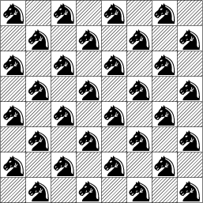

# $N^2$-Knights

## Problem Definition

In chess, a knight can move to any square that is two squares away horizontally and one square away
vertically, or two squares vertically and one square horizontally. Therefore, its complete move
looks like the letter "L".


The $N^2$-knights puzzle concerns placing $O(N^2)$ knights on an $n \times n$ chessboard so that no
two knights can attack each other.  Below, you can see a valid configuration for a 8x8 board.



Determine the validity of $N^2$-knights board configurations.

### Hints


A possible brute force solution generates a list of all knight coordinates on the board, and then
checks their pairwise consistency.
Unlike for $N$-queens, there can be $O(N^2)$ knights in a valid $N^2$-knights configuration, see the
second figure.


## Racket

In Racket, implement the function

```scheme
(is_valid? board)
```

where `board` is a list of lists representing an arbitrarily sized board containing binary values,
where 1 denotes a knight and 0 an empty cell; The function returns `#t` if and only if no knight
threatens another one.

### Examples
```scheme
(is_valid? ‘((1 0 0 0)
             (0 0 0 1)
             (1 0 0 0)
             (0 1 0 0)))
#t

(is_valid? '((0 1 0 0)
             (0 0 0 1)
             (1 0 0 0)
             (0 0 1 0)))
#f
```


::: details Solution
```scheme
(define (generate-coords-row row offset row-id)
  (if (null? row)
      '()
      (if (eq? (car row) 1)
          (cons (cons row-id offset) (generate-coords-row (cdr row) (+ offset 1) row-id))
          (generate-coords-row (cdr row) (+ offset 1) row-id)
          )
  )
)
(define (generate-coords-board board offset)
  (if (null? board)
      '()
      (append (generate-coords-row (car board) 0 offset) (generate-coords-board (cdr board) (+ offset 1)) )
  )
  )

(define (is-valid-pair? coord1 coord2)
  (let ((absx (abs (- (car coord1) (car coord2))))
        (absy (abs (- (cdr coord1) (cdr coord2)))))
       (cond ((and (eq? absx 1) (eq? absy 2)) #f)
             ((and (eq? absx 2) (eq? absy 1)) #f)
             (#t #t)
  )))

(define (is-valid-coord? coord coords)
  (cond ((null? coords) #t)
        ((is-valid-pair? coord (car coords)) (is-valid-coord? coord (cdr coords)))
        (#t #f)
  ))

(define (is-valid-coords? coords)
  (cond ((null? coords) #t)
        ((is-valid-coord? (car coords) (cdr coords)) (is-valid-coords? (cdr coords)))
        (#t #f)
  ))


(define (is_valid? board)
  (let ((coords (generate-coords-board board 0)))
    (is-valid-coords? coords)
    ))
```
:::


## Haskell

In Haskell, implement the function

```haskell
is_valid :: [[Piece]] -> Bool
```

where

* `data Piece = Nil | Knight`, with `Knight` denoting a knight and `Nil` an empty cell with no
  piece; Note, the `Piece` type must be defined in your code.
* The function input represents an arbitrarily sized board containing `Nil` and `Knight` pieces.

and the function returns `True` if and only if no knight threatens another one.

### Examples

```haskell
> is_valid [[Knight, Nil, Nil ,Nil],
            [Nil, Nil, Nil, Knight],
            [Knight, Nil, Nil, Nil],
            [Nil, Knight, Nil, Nil]]
True

> is_valid [[Nil, Knight, Nil, Nil],
            [Nil, Nil, Nil, Knight],
            [Knight, Nil, Nil, Nil],
            [Nil, Nil, Knight, Nil]]
False
```

::: details Solution
```haskell
data Piece = Nil | Knight deriving Show

enumerate :: [a] -> [(Int, a)]
enumerate xs = zip [0..] xs


isknight :: Piece -> Bool
isknight Nil = False
isknight Knight = True


knight_coords :: [[Piece]] -> [(Int, Int)]
knight_coords board = map (\(i,j,_) -> (i,j)) ij_ks where 

  ij_ks = filter (\(_,_,k) -> isknight k) (concat ij_xs)
  ij_xs = map (\(i, jxs) -> _insert i jxs) (enumerate (map enumerate board))

  _insert :: a -> [(b,c)] -> [(a,b,c)]
  _insert x = map (\(y,z) -> (x,y,z))


is_valid_pair :: (Int,Int) -> (Int,Int) -> Bool
is_valid_pair (x,y) (u,v) | ( (abs (x-u)) == 2 && (abs (y-v)) == 1 ) = False
                          | ( (abs (x-u)) == 1 && (abs (y-v)) == 2 ) = False
                          | otherwise = True


is_valid :: [[Piece]] -> Bool
is_valid board = all (uncurry is_valid_pair) [(x,y) | x <- cs, y <- cs] where
  cs = knight_coords board


board =  [[Knight, Nil, Nil ,Knight],
          [Nil, Nil, Nil, Knight],
          [Knight, Nil, Nil, Nil],
          [Nil, Knight, Nil, Nil]]

board2 = [[Nil, Knight, Nil, Nil],
          [Nil, Nil, Nil, Knight],
          [Knight, Nil, Nil, Nil],
          [Nil, Nil, Knight, Nil]]
```
:::
