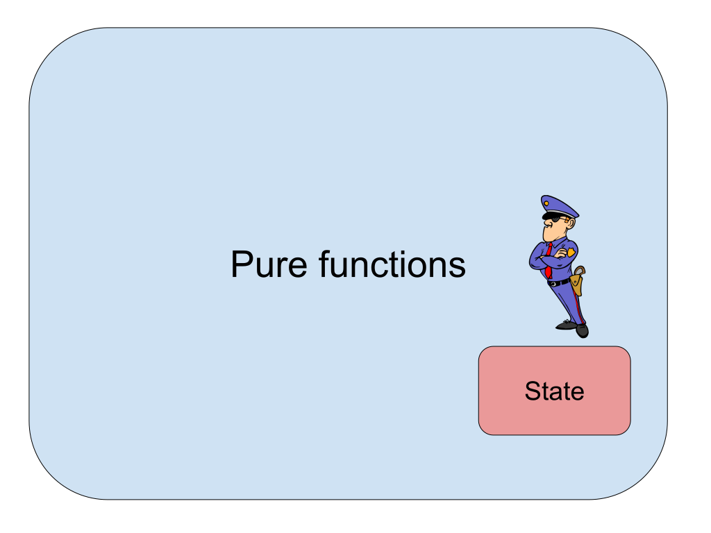
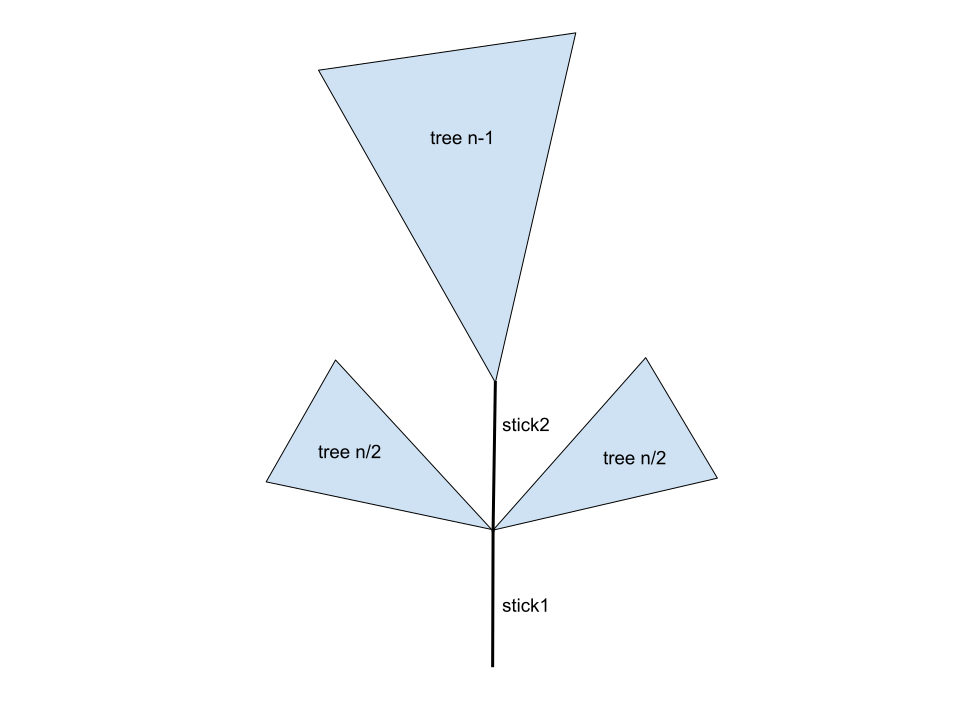
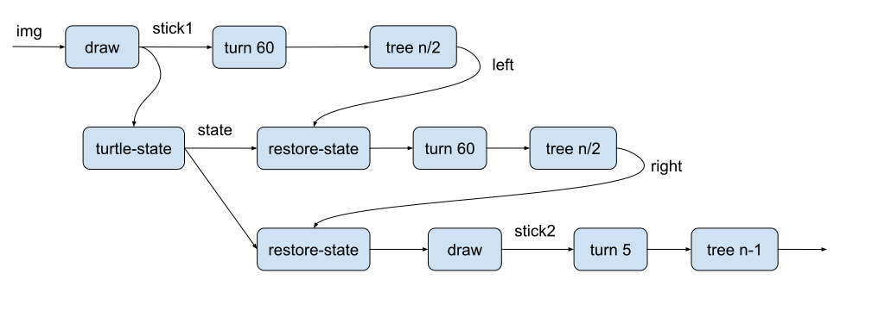

# Introduction

Functional programming is a declarative style of programming where we structure programs as
compositions of functions.
There is no exact definition of functional programming. It is usually described by a collection of
concepts and paradigms used in that programming style. To name a few of them, let me mention, for
example, pure functions, immutable data structures, recursion, higher-order functions, pattern
matching, lazy evaluation, etc. We will touch on all the above concepts later on. For now, I will
discuss the fundamental feature of functional programming: building programs by function
composition. This distinguishes functional programming substantially from the usual imperative
programming style.

Recall that imperative programs are essentially sequences of commands/statements executed in the
given order. The role of the commands is to update the state of the computation. The state holds
intermediate results stored in variables. On the other hand, functional programs are written as a
composition of functions, just like formal expressions in mathematics. Consider, for instance, a
program that returns the smallest element for a given list of integers. To construct such a program,
we would start with primitive functions provided by the programming language and create the program
by composing them. The resulting program would be represented by a function transforming any list of
integers into its smallest element. In Haskell, this could be done as follows:

```haskell
getSmallest :: [Int] -> Int
getSmallest xs = head (sort xs)
```

The first line declares the type of the function `getSmallest`, taking a list of integers and
returning an integer. The second line defines `getSmallest` as a composition of functions, `sort`
and `head`. Thus the input list is sorted, and the first element is returned. This definition is
much like in mathematics, where we could define $\mathrm{getSmallest}(xs) =
\mathrm{head}(\mathrm{sort}(xs))$. We can further simplify this definition to $\mathrm{getSmallest}
= \mathrm{head}\circ\mathrm{sort}$ where $\circ$ denotes the [function
composition](https://en.wikipedia.org/wiki/Function_composition). Analogously, we can shorten the
definition in Haskell using the dot operator.

```haskell
getSmallest :: [Int] -> Int
getSmallest = head . sort
```

The above example is simple because we compose just two functions. In reality, we need to compose
many more functions. Moreover, these compositions need not be fixed but can depend on the input. So
let us investigate a more complicated example. Suppose we are given a string, and our task is to
create a histogram of characters occurring in the string. I will compare the imperative approach and
the functional one. An imperative solution in Python could look like this:

```python
def make_histogram(str):
    hist = {}
    for ch in str:
        if ch in hist.keys():
            hist[ch] += 1
        else:
            hist[ch] = 1
    return hist
```

The dictionary `hist` represents the histogram. For example, calling
```python
make_histogram("hello")
```
returns
```python
{'h': 1, 'e': 1, 'l': 2, 'o': 1}
```
Note how the state is updated. We start with the empty dictionary representing the initial state.
Next, we iterate through the characters in the string and update the dictionary. If the current
character `ch` is in the dictionary, we increase the number of its occurrences by 1. If not, we
insert `ch` into the dictionary with the value 1.

Now we solve the same task using the functional style in Haskell. Before we dive into the actual
Haskell code, we formulate the task mathematically. As our only tool is function composition, we
cannot use a state that we would update. Instead, we will pass the intermediate dictionary to a
function returning its updated version. Let $Char$ and $Dict$ denote the set of characters and
dictionaries, respectively. The input for our task is a string which can be viewed as a list of
characters. The empty dictionary is denoted $\{\}$. We look for a function $\mathrm{mkHist}$ that
transforms a string into the desired histogram. Suppose we have a function $up\colon Dict\times Char
\to Dict$ updating a given dictionary by a given character. When evaluated on the string
$\mathtt{"hello"}$, the function $\mathrm{mkHist}$ should do the following:

$$
\mathrm{mkHist}(\mathtt{"hello"}) =
\mathrm{up}(\mathrm{up}(\mathrm{up}(\mathrm{up}(\mathrm{up}(\{\},
  \mathtt{'h'}), \mathtt{'e'}), \mathtt{'l'}), \mathtt{'l'}), \mathtt{'o'})
$$

Note that we compose the function $\mathrm{up}$ as many times as there are characters in the input
string. However, it is necessary to know the input if we want to write down the composition above.
Thus we need a construction allowing us to iterate through a list and create a sequence of function
compositions, provided we have a function updating the intermediate result. Functional programming
languages offer such a construction. It is a function usually called $\mathrm{foldl}$ or
$\mathrm{foldr}$, depending on which order we want to iterate through the list, either from left to
right or right to left. Using $\mathrm{foldl}$, we could define  $\mathrm{mkHist}$ as follows:

$$\mathrm{mkHist}(str) = \mathrm{foldl}(\mathrm{up}, \{\}, str)$$

The function $\mathrm{foldl}$ takes three arguments. The first is the updating function, the second
is the initial value, and the last is the list to process. Now you can think: *Wait a minute! If we
need a special function for this type of iteration, there might be a lot of functions allowing us to
iterate through a list and do something.* Actually, it is not so bad. There are only a few because
we can parametrize them by functions, so they are pretty general. Moreover, we can define new ones
through recursion if you need something nonstandard. For instance, $\mathrm{foldl}$ can be
recursively defined as follows:

$$
\mathrm{foldl}(f, st, lst) = \begin{cases}
  st & \text{if } lst=[\,]\\
  \mathrm{foldl}(f, f(st, x_1), [x_2,\ldots]) & \text{if } lst=[x_1,x_2,\ldots]
\end{cases}
$$

where $f$ is the function taking an intermediate result $st$ and an element $x_i$ from the list
$lst$ and returning the updated intermediate result. The definition is recursive because the
function $\mathrm{foldl}$ calls itself. If $lst$ is empty, we just return the initial value. If not,
we strip the first element from $lst$, call the function $f(st, x_1)$ creating an updated
intermediated result, and finally, we call $\mathrm{foldl}$ again on the remaining list. If we
expand the definition on a concrete list, say $[1,2,3]$, we get the following:

$$
\begin{align*}
\mathrm{foldl}(f, st, [1,2,3]) & = \mathrm{foldl}(f, f(st, 1), [2,3])\\
                               & = \mathrm{foldl}(f, f(f(st, 1), 2), [3])\\
                               & = \mathrm{foldl}(f, f(f(f(st, 1), 2), 3), [])\\
                               & = f(f(f(st, 1), 2), 3)
\end{align*}
$$


Now the solution in Haskell should be transparent.
```haskell
mkHist :: String -> Map Char Int
mkHist = foldl update empty
    where update m ch = insertWith (+) ch 1 m
```
We use a data structure `Map Char Int` similar to Python's dictionary to store the histogram, where
keys are characters and values are integers. We apply the provided function
[`insertWith`](https://hackage.haskell.org/package/containers-0.6.6/docs/Data-Map-Strict.html#v:insertWith)
to update the intermediate result. It takes four arguments. The first is a binary function updating
existing key-value pairs, the second is the key to be inserted, the third is the updating value, and
the last is the dictionary. For example, if we call
```haskell
insertWith (+) ch 1 m
```
there are two possible outcomes: either the pair `(ch,1)` is inserted into `m` if `ch` is not already present in `m`, or `(ch,v+1)` is inserted into `m` if `(ch,v)` is in `m`.

I hope the above example gave you a flavor of functional programming. Next, I will discuss what
consequences it has using the functional programming style.


### Pure functions

In the example above, we have seen that functional programming structures programs as function
compositions in the mathematical sense. Thus we cannot use a state (i.e., a data structure keeping
intermediate results updated as the computation proceeds); instead, we pass the intermediate results
as arguments to other functions. It is a good idea to distinguish the notion of a function here.
Functions are standard in most programming languages. However, a usual function in an imperative
programming language need not be mathematical. First, it can do other stuff, not only computes its
returning value. Second, its returning value might depend on other data, not only its arguments.
Consider, for instance, the following functions:

```python
counter = 0

def do_other(x):
  global counter
  counter += 1
  return x**2

def depends_on_other(x):
  return counter + x**2
```

The function `do_other` computes $x^2$ but also increments a global variable `counter`. The
returning value of  `depends_on_other` depends on the global variable `counter`. So, if we evaluate
these functions in the following order, we get

```python
depends_on_other(5) => 25
do_other(3) => 9
depends_on_other(5) => 26
```
Consequently, `depends_on_other` returns different results even if its input is the same.
Mathematical functions cannot do things like this. Therefore people introduced the notion of a pure
function to distinguish mathematical functions in programming terminology.

::: tip Definition
A *pure function* is a function that,  given the same input, always returns the same
output and does no side effects.
:::

Hence a pure function behaves like a mathematical function; its output depends only on its arguments
and nothing more. It cannot depend on a global variable or a random value, read a file on a disk,
connect to a database, or read a pressed key on the keyboard. Moreover, it cannot cause side
effects. What are the side effects? Typical examples of side effects are:

- Mutation of a global variable or any of the input arguments.
- Writing data to a file or database.
- Printing something to the screen.

As functional programs rely on pure functions, they might seem useless because they cannot do
anything real, like printing to the screen. Fortunately, this is not true, as we will see later on.
Let me first explain why it is a good idea to use pure functions and eliminate state and side
effects.

### Troublesome state

The critical issue caused by the mutable shared state is that it creates implicit connections
between all parts of the program. Changing something in the code might influence seemingly unrelated
pieces of our code because any function, in principle, can access the state and read it or mutate
it. This issue becomes even more severe if we work on a large software project developed by many
programmers. Consider, for example, the following piece of code:

```python:line-numbers
status = 0

def do_something():
  if status == 1:
    raise Exception("Invalid status.")
  else:
    # do some stuff
    print("Do some stuff")

def set_status(data):
  global status
  if valid(data):
    status = 0
  else:
    status = 1
```

We have a global binary variable `status`, which is 0 if the status is OK and 1 if not. There is a
function `do_something` relying on `status` raising an exception if the status is incorrect.
Finally, a function called `set_status` takes data and sets the status based on data validity.
Suppose that the coder responsible for `set_status` decides to enrich the information stored in the
variable `status` by distinguishing various types of invalid data. So he-or-she introduces, say, a
new status value 2. At that moment, the function `do_something` could go wrong because its author
did not expect 2 as a possible value for the status.

Another problem caused by the shared mutable state is nontrivial unit testing. It is easy to test
pure functions without investigating their inner code. Simply choose some testing inputs and check
if the outputs are correct. This approach does not work for impure functions as they depend on
external data or make a side effect. So to test such a function, all the external data must be set
up and the resulting side effects checked. Thus the tester needs to investigate the inner code and
identify them. This task might be challenging if the function calls further nested functions.

Software engineers are aware of the issues caused by the mutable state. Therefore they invented
various approaches how to mitigate them. For instance, the state is privately distributed inside
object instances in object-oriented programming. Only the object's methods can mutate the state, so
the state mutation is protected. Moreover, the methods can check if the updated state values are
consistent. However, it only partially resolves the issues. Functional programming goes even
further. It restricts the mutable state to the bare minimum.

### State separation

Functional programming promotes pure functions as much as possible. Ideally, it is reasonable to
compose our programs using only pure functions because it has the following advantages:

- Unit tests are painless, as explained above.
- Reasoning about programs is more straightforward because there are no hidden links between
  unrelated pieces of code.
- It is safe to reuse any subprogram and call it as many times as you wish because it cannot alter
  any hidden data structure.
- It is less complicated to make your code run concurrently or in parallel. This is because
  functional programs do not force a strict sequential execution in contrast with imperative
  programs.

On the other hand, it is apparent that side effects are inevitable. We want our programs to be able
to do side effects like writing to a database. Different approaches exist to deal with side effects
in functional programming languages. The general idea is to use pure functions as much as possible
and handle the side effects and stateful computations in a tiny transparent part of your code.

{ style="width: 60%; margin: auto;" }

Let me mention a few concrete approaches. Some functional programming languages allow you to have a
mutable state and do side effects. In such cases, it is up to the developer to make the stateful
part of the program sufficiently small and transparent. Among such languages are Lisp-like languages
like Scheme or Racket.

Another approach Haskell uses is a strict separation of pure code from the stateful one by means of
the type systems. So you are allowed to bring the values computed in the pure part to the stateful
one but not the other way around. Nevertheless, it is still up to the coder to keep the stateful
part as small as possible. We will discuss that approach in more detail later on.

The last approach I want to mention is the approach of the programming language
[Elm](https://elm-lang.org/). Elm is a domain-specific programming language for declaratively
creating web browser-based graphical user interfaces. It is a purely functional language, so all the
functions must be pure. Mutations of the state and side effects are left to the Elm runtime. A
developer just specifies (via pure functions) how to update the state based on the messages
generated by the browser. More precisely, an Elm application consists of three components model,
update, and view.

1. The **model** specifies a data structure used by the runtime to keep the state of the application
   and a function setting the initial state.
2. The **update** part is a function whose input is the current state and a message generated by the
   browser that returns a new state.
3. The **view** component is responsible for rendering an HTML document for the current state.

The following picture shows the basic architecture. The Elm runtime applies the view component to
render the HTML document. If the browser generates a message, the runtime uses the update function
to mutate the current state.

{ style="width: 70%; margin: auto;" class="inverting-image"}

Below you can find an example of a simple Elm application allowing the user to enter a string and displaying a histogram of digits occurring in the entered string. Note that the state is captured by the type `Model` consisting of the entered string `content` and a dictionary representing the histogram. The function `init` sets up the empty initial state. The function `update` creates a new state based on the message (in this case, a new string entered by the user). Thus `content` is set to `newContent`, and the function `transform` computes a new histogram. Note that `transform` is just a composition of functions (`>>` denotes the function composition):

1. `toList` breaks the string into a list of characters.
2. `List.filter isDigit` filters only digits.
3. The histogram is computed by `foldl` analogously to the Haskell example above.

Finally, the function `view` renders the application based on the state. It creates a `div` containing an input box and an SVG image. This image consists of bars whose height depicts the number of occurrences and digits in the input string. There is an auxiliary function, `disp`, that iterates through the dictionary and renders either bars or digits depending on the first argument (i.e., either the function `bar` or `chr`).

```elm:line-numbers
module Webapp exposing (main)

import Browser
import Html exposing (Html, Attribute, div, input)
import Html.Attributes exposing (placeholder, value)
import Html.Events exposing (onInput)
import String exposing (toList, fromChar, fromInt)
import Char exposing (isDigit)
import List exposing (indexedMap, foldl)
import Svg exposing (..)
import Svg.Attributes exposing (..)
import Dict exposing (Dict, empty)

-- MAIN

main = Browser.sandbox { init = init, update = update, view = view }

-- MODEL

type alias Model =
  { content : String
  , hist : Dict Char Int
  }

init : Model
init =
  { content = ""
  , hist = empty
  }

-- UPDATE

type Msg = Change String

update : Msg -> Model -> Model
update msg model =
  case msg of
    Change newContent ->
      { model | content = newContent
      , hist = transform newContent
      }

transform : String -> Dict Char Int
transform = toList >> List.filter isDigit >> foldl (\k -> Dict.update k add1) empty

add1 : Maybe Int -> Maybe Int
add1 x = case x of
  Nothing -> Just 1
  Just n -> Just (n+1)

-- VIEW

bar : Int -> (Char, Int) -> Svg Msg
bar m (_, n) = rect
          [ x (fromInt (m*20))
          , y (fromInt (300-n*20))
          , width "20"
          , height (fromInt (n*20))
          , fill "lightgreen"
          , stroke "black"
          , strokeWidth "2"
          ]
          []

chr : Int -> (Char, Int) -> Svg Msg
chr m (c, _) = text_
          [ x (fromInt (m*20 + 10))
          , y "320"
          , fill "black"
          , textAnchor "middle"
          ]
          [ text (fromChar c) ]

disp : (Int -> (Char, Int) -> Svg Msg) -> Model -> List (Svg Msg)
disp f = .hist >> Dict.toList >> indexedMap f

view : Model -> Html Msg
view model =
  div []
    [ input [ placeholder "Enter text", value model.content, onInput Change ] []
    , div []
        [ svg
          [ viewBox "0 0 400 400"
          , width "400"
          , height "400"
          ]
          (disp bar model ++ disp chr model)
       ]
    ]
```

You can test the app by yourself. If you want to play with code, go to this
[site](https://elm-lang.org/examples/hello), erase the code there, and enter the code above.

### Immutability

I want to finish this introductory text with a common misconception regarding functional
programming. The usage of pure functions has several consequences. I already pointed out some of
their advantages. However, there is a price one has to pay, namely a lower performance in comparison
with the imperative languages. Nevertheless, the price is not as high as it might look at first
sight.

Since pure functions cannot mutate any data structure, all the data processed by a purely functional
program must be immutable. We must create a new copy with the required modifications to update a
data structure. This seems to be pretty inefficient. For example, to modify a single element in a
big array, a naive implementation would be to copy the whole array and change one element.
Fortunately, a much more efficient way to deal with this issue involves using [persistent data
structures](https://en.wikipedia.org/wiki/Persistent_data_structure). Roughly speaking, to most of
the standard imperative data structures, there is a purely functional equivalent whose performance
is slower at most by a logarithmic factor. By **persistent** we mean that we try to reuse and share
the data among data structures as much as possible. Thus we do not copy the whole array, but only a
tiny part of it, and the remaining elements are shared across both arrays. The sharing is possible
because all the data are immutable until the garbage collector removes them. The persistent analogs
of common imperative data structures are usually implemented in libraries distributed with
functional languages, so an everyday coder can rely on them without knowing the details. The topic
of persistent data structures is quite advanced. Those who are interested in details might check the
book by Okasaki[^book].

[^book]: Chris Okasaki: Purely functional data structures. Cambridge University Press 1999, ISBN 978-0-521-66350-2, pp. I-X, 1-220


## Racket

The first programming language we are going to explore is [Racket](https://racket-lang.org/). It is
a dialect of [Lisp](https://en.wikipedia.org/wiki/Lisp_(programming_language)), one of the oldest
high-level programming languages (it was invented right after Fortran). "Lisp" stands for **LISt
Processor**, suggesting the lists are the primary data structures in Lisp and Racket. Racket is not
a purely functional programming language as it allows defining functions that may cause side
effects. It has a simple syntax and a [dynamic
type-checking](https://en.wikipedia.org/wiki/Type_system#DYNAMIC) mechanism. This means that types
of objects are checked during the runtime.

An exciting property of Racket and other Lisp-like languages is so-called
[**homoiconicity**](https://en.wikipedia.org/wiki/Homoiconicity) (a.k.a. *code as data*). Programs
written in such a language form an intrinsic data structure in that language. Consequently,
metaprogramming is more straightforward as one can manipulate programs with other programs. For
example, Racket's powerful macro system allows us to define syntactical transformations of our
program that are executed before the program is compiled or interpreted. We will use the
homoiconicity later to implement an interpreter for a language with a Lisp-like syntax.

For writing Racket programs, we will use DrRacket distributed with
[Racket](https://racket-lang.org/). It is an IDE where we can implement and run a program using the
provided read-eval-print loop (REPL). Nevertheless, you can develop your programs in any text
editor, e.g., VS Code. In the case of VS Code, I recommend installing the [Magic
Racket](https://marketplace.visualstudio.com/items?itemName=evzen-wybitul.magic-racket) extension.

### Syntax

Racket's syntax more-or-less extends the syntax of Lisp. Each Racket source file must start with the
following line:

```racket
#lang racket
```

It specifies what language should be used to interpret the source code. The Racket system provides
compilers for several other languages. It was actually designed as a language for so-called
*language-oriented programming*[^manifest]. This means the Racket system allows easy development of
new programming languages.

[^manifest]: Felleisen, M.; Findler, R.B.; Flatt, M.; Krishnamurthi, S.; Barzilay, E.; McCarthy, J.;
    Tobin-Hochstadt, S. (2015). [The Racket
    Manifesto](https://www2.ccs.neu.edu/racket/pubs/manifesto.pdf). Proceedings of the First Summit
    on Advances in Programming Languages: 113–128.


Racket programs consist of four types of syntactical forms:

1. *Primitive expressions* are either literals like numbers or strings, e.g.,
```racket
"Hello World!"
```
or built-in functions, e.g.,
```racket
cos
```
2. *Compound expressions* are built up from primitive expressions using the function composition, e.g.,
```racket
(cos (+ 1 2))
```
The compound expressions are formed by so-called **S-expressions**. They look as follows:
```racket
(fn arg1 arg2 ... argN)
```
where `fn` is a function and `arg1`,...,`argN` are its arguments.  This prefix notation is also used
for the usual infix arithmetic operations like addition or multiplication. For example, the
expression $\frac{xy^2+3}{x-1}$ would be written as
```racket
(/ (+ (* x y y) 3) (- x 1))
```
The prefix notation has the advantage that we can avoid dealing with operators' precedence.
Moreover, operations like + or * can take an arbitrary number of arguments.

3. *Definitions* allow us to name an expression or define new functions, e.g.,
```racket
(define a 1)
(define (square x) (* x x))
```
More precisely, if we want to name an expression, we use the following construction:
```racket
(define id exp)
```
where `id` is the name/identifier for the expression `exp`. If we want to define a function, we do it as follows:
```racket
(define (fn a1 ... aN)
  exp)
```
where `fn` is the name of the defined function and `a1`,...,`aN` are its parameters.
The body of the function consists of an expressions `exp` depending on the parameters.[^def-syntax]

[^def-syntax]: I simplified the syntax of definitions for explanatory purposes. Further
    possibilities, like default parameters, variable numbers of parameters, etc., will be discussed
    later on.

4. Finally, we have *line comments* and *block comments*, e.g.,
```racket
; This is a one-line comment
#|
  This is
  a block comment
|#
```

### Semantics

The previous section shortly presented the syntax of Racket, i.e., how to write grammatically
correct programs. Next, we need to discuss the semantics, i.e., the meaning of programs and their
parts. Here it becomes interesting if we compare it with imperative programming. Recall that
imperative programs are sequences of commands/instructions. The computation process executes the
instructions consecutively in the given order.

On the other hand, a Racket program is an expression[^seq-exp]. It represents a computation process
evaluating the expression. The evaluation resembles simplifying expressions we know from math. More
precisely, we subsequently evaluate subexpressions until we end up with the expression's value
(i.e., the expression's meaning).

[^seq-exp]: More generally, it might be a sequence of expressions evaluated in the given order.

Now let me discuss the evaluation process in more detail. Recall that expressions are built from
primitive expressions using function composition. The values/meanings of primitive expressions are
determined directly by Racket. For instance, the value/meaning of the literal `3.14` is the number
$3.14$, or `cos` denotes the cosine function.

To see the evaluation of a compound expression, consider the following simple Racket program. It
defines a function square that, to every $x$, assigns $x^2$ and consists of a single expression.
```racket
(define (square x) (* x x))

(square (+ 3 4))
```

The evaluation of the expression might start by evaluating the subexpression `(+ 3 4)`. It consists
only of primitive expressions with a given meaning. Thus its resulting value is $3+4=7$. Next, we
can expand the function square definition, i.e., replace `(square 7)` with `(* 7 7)`. The final
value is $7*7=49$.
```racket
(square (+ 3 4)) => (square 7) => (* 7 7) => 49
```

Note that this is not the only possible way to evaluate the program. Alternatively, we could proceed as follows:
```racket
(square (+ 3 4)) => (* (+ 3 4) (+ 3 4)) => (* 7 7) => 49
```
In other words, we can first expand the definition and  then evaluate the subexpressions `(+ 3 4)`. This leads to the conclusion that the evaluation process is not uniquely determined. Consequently, each functional programming language comes with its  *evaluation strategy*. There are two prominent families of strategies.

1. **Strict** strategies evaluate the function's arguments before the function definition is expanded. This corresponds to the first evaluation example above.
2. **Non-strict** strategies might postpone the evaluation of the function arguments until they are needed. This corresponds to the second evaluation example above.

The advantage of strict strategies is that we evaluate each argument only once. On the other hand, a strict strategy may evaluate an argument that is not needed. Racket's evaluation strategy is strict.

Non-strict strategies avoid evaluating unnecessary arguments but might duplicate the argument expressions (as in the example above). This problem is usually compensated by caching, i.e., the values of evaluated expressions are cached and reused). Haskell is a typical example of a language with a non-strict evaluation strategy referred to as *lazy*.

### Conditional expressions

Although Racket's evaluation strategy is strict, there are a few exceptions, particularly conditional expressions. Two basic approaches to branching a program based on a Boolean test exist. The first is the if-then-else expression.

```racket
(if test-exp then-exp else-exp)
```
As the if-then-else expression must have a value, both `then-exp` and `else-exp` are required. This contrasts with imperative programming, where the else branch is often optional.

The evaluation process of the if-then-else expression first computes the value of `test-exp`. If the
result is `#f`, then `else-exp` is evaluated, and its value is also the value of the if-then-else
expression. If the result is not `#f` [^true-values], the value of `then-exp` is the value of the
if-then-else expression.  Thus only one of the branching expressions gets evaluated. For example,
the following expression gets evaluated without throwing an error even if `n` is bound to zero.

[^true-values]: Any value different from `#f` is considered true for Boolean tests.

```racket
(if (zero? n) 0 (/ 1 n))
```
Thus if `n` is zero, the resulting value is $0$ and $1/n$ otherwise.

If we need to branch the evaluation to more than two branches, we can use the cond-expression.[^brackets]
```racket
(cond [test-exp1 exp1]
      [test-exp2 exp2]
      ...
      [else else-exp])
```

[^brackets]: Note the use of square brackets `[]`. They are semantically equivalent to parentheses
    `()`. Thus you can freely replace them. In Racket, coders use them to make the code better
    readable.

The test expressions `test-exp1`, `test-exp2`, ... get evaluated in the given order. Once any of them is evaluated as true (i.e., its value does not equal `#f`),  the corresponding expression on the right-hand side gets evaluated, and its value is the value of the cond-expression. If all the test expressions are evaluated as false, the `else-exp` gets evaluated, and its value is returned. For example, the following expression:
```racket
(cond [(odd? 12) 1]
      [(even? 12) 2]
      [else 3])
```
is evaluated as $2$.

### Data types
The expressions' values are categorized into types (either built-in or user-defined). Let me mention some of the
[built-in types](https://docs.racket-lang.org/guide/datatypes.html?q=type):

- **Boolean**: This type consists of logical values true `#t` and false `#f`.
- **Number**: There are two kinds of numbers, either exact or inexact. The exact support of the infinite precision arithmetic, e.g., `31456/98`. The inexact represent the standard IEEE floating-point numbers with limited precision.
- **Character**: Characters are the standard Unicode characters. Literals representing characters are preceded with `#\`, e.g., `#\A` or `#\λ`.
- **String**: Strings are arrays of characters. The string values are surrounded by double quotes, e.g., `"Hello!"`.
- **Symbol**: Symbols are symbolic values, e.g., `'blue` or `'red`.
- There are many more built-in types, particularly those representing functions or complex data structures like lists or trees. I will discuss some of them in the following lectures.

### Recursion

Finally, I will discuss recursive functions and how to program them. However, let me stress that functional programming languages offer a lot of high-level constructs allowing us to avoid writing recursive functions in many cases. Such constructs are preferred because they make the code shorter, more transparent, and optimized. We will meet some of them later in the following lectures.

Recursion is the key tool in functional programming. We must use recursion whenever we need to make a chain of function compositions whose length depends on the input.

::: tip Definition
A function $f$ is said to be *recursive*, if it calls itself. In other words, $f$ occurs in the body of $f$.
:::

The most straightforward recursive function is the parameterless function that calls just itself. It is an infinite functional loop as the function recurs indefinitely.

```racket
(define (loop) (loop))
```

A more practical simple example is the function computing the factorial of a natural number.
```racket
(define (f n)
  (if (= n 0)
      1
      (* n (f (- n 1)))))
```
Note that the code follows the standard recursive definition of factorial from math.
$$
f(n) = \begin{cases}
1 & \text{if}\ n=0,\\
n*f(n-1) & \text{otherwise.}
\end{cases}
$$

We categorize recursive functions into several classes depending on the number of self-referential calls and their locations.

1. If the function calls itself only once, it is called a **linear-recursive function**. This type of recursion is also called **single recursion**.
2. If there is more than one self-referential call, we call the function **tree-recursive function**. This type of recursion is also called **multiple recursion**.

Among linear-recursive functions, we further distinguish a subclass called **tail-recursive functions**. Tail-recursive functions are essential for optimization reasons.

::: tip Definition
A recursive function is *tail recursive* if the final result of the recursive call is the final
result of the function itself. If the result of the recursive call must be further processed (say,
by adding 1), it is not tail recursive.
:::

If we check the example above with the function `f` computing the factorial, we see that `f` is not tail recursive because the result returned by the recursive call
```racket
(f (- n 1))
```
is further multiplied by `n` to get the final result:
```racket
(* n (f (- n 1)))
```
Consequently, the function `f` is less efficient. To see that, consider an example of its evaluation:
```racket
(f 4) => (* 4 (f 3))
      => (* 4 (* 3 (f 2)))
      => (* 4 (* 3 (* 2 (f 1))))
      => (* 4 (* 3 (* 2 (* 1 (f 0)))))
      => (* 4 (* 3 (* 2 (* 1 1)))) => 24
```
Note that if we want to evaluate $f(n)$, we need to keep in memory the growing uncompleted expression $n*((n-1)*((n-2)*\cdots$ until the base case of the recursion. Only then can we start to evaluate the particular multiplications. Thus the function needs $O(n)$ space.

However, the constant space is sufficient to compute the factorial function. It suffices to remember an intermediate result $n*(n-1)*\cdots*(n-k)$. In an imperative language like Python, we would use a loop to update the intermediate result as follows:
```python
def fac(n):
  acc = 1
  for k in range(n,1,-1):
    acc *= k
  return acc
```
We cannot do that in a purely functional language as we cannot update the intermediate result `acc`. Instead, we can pass `acc` to the recursive call.[^square-brackets2]
```racket
(define (fac n [acc 1])
  (if (<= n 1)
      acc
      (fac (- n 1) (* n acc))))
```
[^square-brackets2]: The square brackets in the function definition `fac` allow us to set up a
    default value for a parameter. So our function `fac` has two parameters, but we can call with a
    single one like `(fac 10)`. In that case, the `acc` value is $1$.

Note that `fac` is tail recursive because the value of the recursive call
```racket
(fac (- n 1) (* n acc))
```
is, in fact, the final value returned by the function `fac`. Compare also the evaluation process of
`fac`. We can see that only the counter `n` and the intermediate result `acc` need to be kept in
memory.[^tail]

[^tail]: Someone might argue that this is false because the function arguments are stored on the
    stack for every function call. That is generally true, but compilers/interpreters of functional
    languages can detect tail recursion and clean the stack because we know that the parameters from
    the previous calls will no longer be needed. This trick is called *tail call elimination* or
    *tail call optimization* and allows tail-recursive functions to recur indefinitely.

```racket
(fac 4) =  (fac 4 1)
        => (fac 3 4)
        => (fac 2 12)
        => (fac 1 24)
        => 24
```

A linear-recursive function creates a chain of recursive calls. Thus its time complexity is given by
the number of recursive calls multiplied by the time needed for a single call. On the other hand,
tree-recursive functions generate a tree of recursive calls. Thus the number of recursive calls
grows exponentially in the recursion depth. So one should be careful when designing a tree-recursive
function. Still, tree-recursive functions are natural and powerful when dealing with tree-structured
data like algebraic expressions or tree-generative processes like fractals.


#### Drawing trees

As an example of the tree recursion, consider a tree-like fractal of a given size $n$ and direction
$d$ in degrees generated according to the following rules:

1. Draw a stick of size $n/2$ in the direction $d$.
2. Draw the fractal of size $n/2$ in the direction $d+60$.
3. Draw the fractal of size $n/2$ in the direction $d-60$.
4. Draw a stick of size $n/2$ in the direction $d$.
5. Draw the fractal of size $n-1$ in the direction $d+5$.

This infinite recursive process is shown in the figure below. First, we draw `stick1`. Second, we
recursively draw two half-sized fractals, one in the direction heading to the left and one heading
right. Next, we draw `stick2`. Finally, we recursively draw a smaller fractal in the direction
slightly tilted to the left. Thus this procedure is tree recursive because it contains three
recursive calls.

{ style="width: 100%; margin: auto;" class="inverting-image"}

Now, let us see how to program this procedure in Racket. First, we need a drawing library if we want
to draw something. Racket contains a simple library called
[value-turtles](https://docs.racket-lang.org/turtles/Value_Turtles.html).
Functions in this library update an image containing "a turtle" with a position and direction. For
example, we can draw a line of a given length in the turtle's direction or turn the turtle by an
angle. Further, we can extract the turtle's state from a given image and restore the state later on.
The code of the program is below.

::: code-group
```racket:line-numbers [DrRacket]
#lang racket
(require graphics/value-turtles)

(define init (turtles 600 600 450 500 (* 1.5 pi)))
(define stick-size 2)

(define (tree n [img init])
  (cond [(<= n 1) img]
        [else
         (define stick1 (draw (/ (* stick-size n) 2) img))
         (define state (turtle-state stick1))
         (define left (tree (/ n 2) (turn 60 stick1)))
         (define right (tree (/ n 2) (turn -60 (restore-turtle-state left state))))
         (define stick2 (draw (/ (* stick-size n) 2)
                              (restore-turtle-state right state)))
         (tree (- n 1) (turn 5 stick2))]))

(tree 25)
```
```racket:line-numbers [Console]
#lang racket

;;; When running from the command line without image support,
;;; we will need to save the bitmap to a file.

(require graphics/value-turtles pict)

;;; The initial empty picture 600x600 and turtle's state
(define init (turtles 600 600 450 500 (* 1.5 pi)))

(define (tree n [img init])
  ; draw subtree at an angle
  (define (draw-angled n ang img)
    (tree n (turn ang img)))
  ; main drawing procedure
  (define (draw-main n)
    (let* ((stick1 (draw n img))
           (origin (turtle-state stick1))
           (rel-left (draw-angled (/ n 2) 60 stick1))
           (left (restore-turtle-state rel-left origin))
           (rel-right (draw-angled (/ n 2) -60 left))
           (right (restore-turtle-state rel-right origin))
           (stick2 (draw n right))
           (final (draw-angled (- n 1) 5 stick2)))
      final))
  ; stop if too small
  (if (> n 1)
      (draw-main n)
      img))

(let* ((pic (turtles-pict (tree 29)))
       (bmp (pict->bitmap pic)))
  (send bmp save-file "leaf.png" 'png))
```
:::

Line 2 is just loading the drawing library. Line 4 creates the initial empty image `init`
of size 600x600 with the turtle heading up and its position $(450,500)$. Line 5 defines a
multiplicative parameter so that we can modify the size of the drawn sticks.

Lines 7-16 define the recursive function `tree` of two arguments. The first is the size,
and the second is the image keeping the intermediate result. Its default value is the empty image
`init`. As we do not want the function `tree` to recur infinitely, we must stop the recursion if the
tree is too small. That happens on Line 8. If $n\leq 1$, we no longer recur and return
just the intermediate result `img`.

Lines 10-16 form the core functionality. As it is a more complex function composition,
it would be hardly readable if we wrote it in a single expression. Thus we introduce local
definitions[^local-def] to name several intermediate values. To get a better picture of the
composition, check the picture below.

[^local-def]: Definitions in Racket using `define` can be nested. However, they are not allowed
    everywhere in the code. For example, we cannot place them into the then-expression of an
    if-then-else expression. In such cases, one can make local definitions by the
    [let-expression](https://docs.racket-lang.org/guide/let.html), which I will discuss in the
    following lecture.

{ style="width: 100%; margin: auto;" class="inverting-image"}

So we first take the input image `img` and draw `stick1` (Line 10). Next, we extract the
turtle's state (Line 11) and call it `state`. In the image containing `stick1`, we turn
the turtle by 60 degrees counter-clockwise and make a recursive call drawing the half-sized fractal
(Line 12). The resulting image is called `left`. Next, we must restore the turtle's
state, so its position is on top of `stick1`. Consequently, we turn the turtle by 60 degrees
clockwise and make the recursive call again (Line 13). The resulting image is named
`right`. Afterward, we restore the state and draw `stick2` (Line 14-15). Finally, we
turn the turtle by 5 degrees counter-clockwise and make the last recursive call (Line 16).

Line 18 contains the main program's expression that gets evaluated when we run the
program. The resulting image is shown below.

{ style="width: 60%; margin: auto;" class="inverting-image"}

## Summary

- A pure function always returns the same output on a fixed input and has no side effects.
- Functional programmers make the pure part of their program as large as possible, keeping the code handling the application state transparent and small.
- There are several evaluation strategies. Strict ones evaluate all the function's arguments before the function's definition is expanded. Non-strict strategies postpone the evaluation until the actual values are needed.
- Functional languages handle iterative computations by recursion, unlike imperative languages that use loops.
- We classify recursive functions according to the number of recursive calls in their body on linear-recursive and tree-recursive functions.
- Tail recursive functions are space efficient as they do not consume memory by making recursive calls.
- The tree recursion might generate an exponential computational process.
