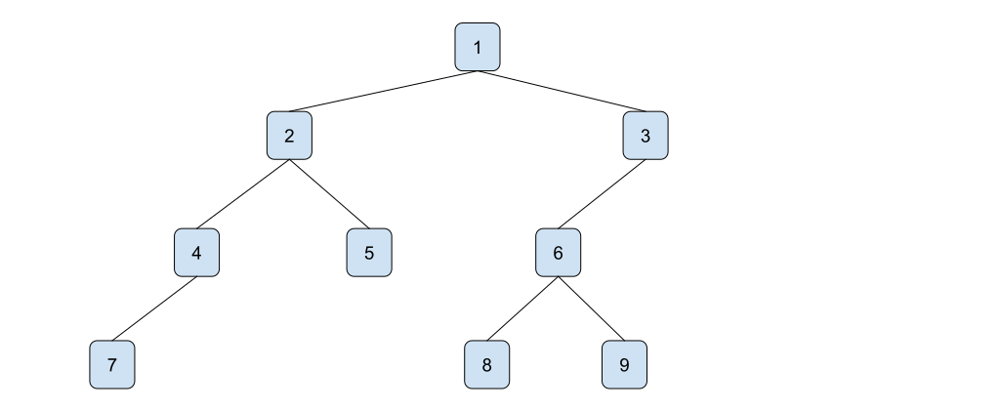

# Hierarchical Data Structures

In the previous lecture, I mentioned only basic data types representing numbers, characters,
strings, etc. This lecture introduces variable-sized data structures like lists and trees.

## Pairs

We start with a simple data structure called **pair**. As its name suggests, a pair can hold two
values. It is ordered so that we can distinguish its first value and the second one. To construct a
pair given two values, `a` and `b`, we use the function `cons`, e.g., a pair consisting of the
character `A` and the number `65` is constructed as follows:
```scheme
(cons #\A 65) => '(#\A . 65)
```
Conversely, given a pair, we can extract its first value by the function `car`. The function
`cdr`[^pair-names] extracts the second value. For example:
```scheme
(define p (cons #\A 65))
(car p) => #\A
(cdr p) => 65
```

[^pair-names]: The names `cons`, `car`, and `cdr` comes from the original Lisp interpreter
    implemented for the IBM 704 computer. `cons` stands for *construct*. `car` and `cdr` were
    abbre­vi­a­tions for *contents of the address part of the register* and *contents of the
    decre­ment part of the register*.

So far, it does not seem very powerful, as pairs contain only two values. However, we can build more
complex data structures from pairs because the pair's components can be arbitrary values,
particularly pairs again. For example, the following pair
```scheme
(cons (cons 1 (cons 2 3)) (cons 'b #f))
```
is a pair whose first component is another pair consisting of the value `1` and a pair of values `2`
and `3`. The second component of the pair is a pair consisting of the symbol `'b` and the false
value `#f`.

As we can nest pairs arbitrarily, one can encode lists as nested sequences of pairs.

## Lists

A *list* is a sequence of values. The length of the list can be arbitrary. The empty list is denoted
either `'()` or `null`. Using the fact that pairs can be nested, we can encode a non-empty list
$(1,2,3,4)$ as a nested sequence of pairs:
```scheme
(cons 1 (cons 2 (cons 3 (cons 4 '()))))
```
Thus the first component of any pair holds the actual data, and the second component contains the
rest of the list.  If we evaluate the above expression in the REPL, the result is:
```scheme
'(1 2 3 4)
```
It would be tedious to encode lists as nested pairs. Fortunately, Racket introduces more convenient
ways to create lists even though they are physically encoded via pairs.

There are several ways to construct a list.

1. One can construct a list by nesting pairs using the function `cons`.

2. The next method is the function `list` that takes any sequence of expressions and returns the
   list of values produced by evaluating the expressions.  For example,
```scheme
(list 1 2 3 4) => '(1 2 3 4)
```
returns the same 4-element list as above. Another example showing that `list` evaluates the given expressions:
```scheme
(list 1 2 (+ 2 1) 4) => '(1 2 3 4)
```

3. The third method is the function `quote`. Unlike `list` that evaluates all the given arguments,
   `quote` takes a single S-expression and returns a list of the expression's components without
   evaluating them. For example,
```scheme
(quote (1 2 (+ 2 1) 4)) => '(1 2 (+ 2 1) 4)
```
As the function quote is needed quite often, the expression
```scheme
(quote exp)
```
can be shortened as follows:
```scheme
'exp
```
4. Lastly, there is a combination of the above method called *quasiquoting*. It is useful when we
   need to evaluate only some expressions representing the list members. Using the function
   `quasiquote`, we can create a list from an S-expression. Moreover, if we want to evaluate any
   subexpressions, it suffices to wrap it by `unquote` function.
```scheme
(quasiquote (* 1 (unquote (+ 1 1)) 2)) => '(* 1 2 2)
```
Again, the above example can be compactly written as follows:
```scheme
`(* 1 ,(+ 1 1) 2) => '(* 1 2 2)
```

Apart from the above list-construction methods, we can construct new lists by combining existing
ones. For example, appending several lists together creates a new list.
```scheme
(append '(1) '(2) '(3 4)) => '(1 2 3 4)
```

Knowing how to construct lists, we also need to discuss how to deconstruct them. In other words, how
to access its members. As lists are nested pairs, it is possible to deconstruct them by the
functions `car` and `cdr`. For example, to access the first element, use `car`:
```scheme
(car (list 1 2 3 4)) => 1
```
To get the list after removing the first element, apply `cdr`:
```scheme
(cdr (list 1 2 3 4)) => '(2 3 4)
```

Further elements can be accessed by composing functions `cdr` and `car`, e.g.,
```scheme
(car (cdr (cdr (list 1 2 3 4)))) => 3
```
To make it more compact, Racket defines a lot of
[shorthands](https://docs.racket-lang.org/reference/pairs.html#%28part._.Pair_.Accessor_.Shorthands%29)
for these compositions, e.g.:
```scheme
(caddr (list 1 2 3 4)) => 3
```

To test if a given list is empty can be done by the function `null?`, e.g.,
```scheme
 (null? (list 1 2 3 4)) => #f
 (null? '()) => #t
```

Next, I will present several examples of how to iterate through lists using recursion. During the
process, I will introduce other concepts used in Racket. In the first example, we will implement a
function filtering a given value from a given list. To do that, we need to explore the equality
concept in Racket.

## Equality

Racket has several functions to test the equality of two values. So we need to choose the right one
depending on the data type. The most general equality function in Racket is `equal?`. It works for
all data types, but it is the slowest one. It recursively inspects all the values stored in the data
structures.

```scheme
(equal? '(1 2 3) (cons 1 (cons 2 (cons 3 '())))) => #t
(equal? "foobar" (string-append "foo" "bar")) => #t
(equal? '() null) => #t
(equal? 42 (* 6 7)) => #t
(equal? 3 3.0) => #f
```
Note the last example showing that `3` and `3.0` are not equal w.r.t. `equal?`. The reason is that
`3` represents an exact number, whereas `3.0` is inexact; for further details, see the
[documentation](https://docs.racket-lang.org/guide/numbers.html).

To test equality on numbers, one can rely on the function `=`. For example,

```scheme
(= 1 2)        => #f
(= 42 (* 6 7)) => #t
(= 3 3.0)      => #t
```
Compare the last case with the result of `equal?` above.

There are two additional functions to test equality: `eqv?` and `eq?`. The first behaves similarly
to `equal?` but works only for primitive data types like numbers, characters, etc. So it does not
work for recursively built data structures like lists. To check quickly whether two expressions
represent the same instance of data by comparing their pointers, one can employ the function `eq?`.
It compares if the data are stored in the same chunk of memory. It is mostly used to test equality
between symbolic values (consult the
[documentation](https://docs.racket-lang.org/reference/Equality.html) for details).

## Recursive list processing

Now I continue with the example illustrating how to iterate through a list. Suppose we want to
implement a function `my-filter` that takes a value `val` and a list `lst` and returns a list
created from `lst` by removing all occurrences of `val`. Thus we need to iterate through each
element of `lst`, check its equality with `val`, and based on the result, append it to the output or
not. The corresponding recursive formulation is straightforward. If `lst` is empty, there is nothing
to filter, and we return the empty list. Otherwise, we extract `(car lst)`, the first element of
`lst`, and compare it with `val`. If `(car lst)` equals `val`, we discard it and return just the
result of the recursive call applied to the remaining list. If `(car lst)` differs from `val`, we
recursively remove `val` from the remaining list and prepend `(car lst)`.

```scheme
(define (my-filter val lst)
  (cond
    [(null? lst) '()]
    [(equal? (car lst) val) (my-filter val (cdr lst))]
    [else (cons (car lst) (my-filter val (cdr lst)))]))
```

Thus except for the base case when `lst` is empty, we recursively evaluate `my-filter` on `(cdr
lst)` and prepend `(car lst)` based on the equality testing. An example of its evaluation:
```scheme
(my-filter 'a '(1 a 2 a)) => (cons 1 (my-filter 'a '(a 2 a)))
                          => (cons 1 (my-filter 'a '(2 a)))
                          => (cons 1 (cons 2 (my-filter 'a '(a))))
                          => (cons 1 (cons 2 (my-filter 'a '())))
                          => (cons 1 (cons 2 '())) = '(1 2)
```

You can note that the above implementation is not tail recursive because we first do the recursive
call and then construct the result. To make it tail recursive, we must keep the intermediate result
in a parameter `acc`.[^accumulator] In the beginning, `acc` is empty. Once we strip off the first
element and test the equality, we either keep `acc` the same, or we must expand it. More precisely,
we need to append the first element to its end. That could be done as follows:

[^accumulator]: Such a parameter is typically called an *accumulator*.

```scheme
(append acc (car lst))
```
However, this is not a good idea because lists are represented as linked lists, so the function
`append` must iterate through the whole accumulator `acc` to append something to the end. Instead,
we will prepend the first element to `acc` by `cons`. In the end, `acc` contains the result but
reversely ordered. Calling the function
[`reverse`](https://docs.racket-lang.org/reference/pairs.html#%28def._%28%28lib._racket%2Fprivate%2Flist..rkt%29._reverse%29%29),
we output the result in the correct order.
```scheme
(define (my-filter-2 val lst [acc '()])
  (cond
    [(null? lst) (reverse acc)]
    [(equal? (car lst) val) (my-filter-2 val (cdr lst) acc)]
    [else (my-filter-2 val (cdr lst) (cons (car lst) acc))]))
```

Now the evaluation proceeds as follows (to make it more readable, I replace the nested `cons` functions with the corresponding lists):

```scheme
(my-filter-2 'a '(1 a 2 a)) => (my-filter-2 'a '(a 2 a) '(1))
                            => (my-filter-2 'a '(2 a) '(1))
                            => (my-filter-2 'a '(a) '(2 1))
                            => (my-filter-2 'a '() '(2 1))
                            => '(1 2)
```

Filtering a list according to a criterion is among frequently occurring operations. However, our
function `my-filter-2` is not general enough because it filters a given list only by removing all
elements equal to `val`. It would be better to make it more universal so that the user can specify
the test which members keep and which remove. The test is a Boolean function assigning true or false
to each member. So to make `my-filter-2` more general, we must pass the test function to it as an
argument. Fortunately, this is possible because functions are treated in Racket (and other
functional programming languages) as normal values. Thus functions can be among function parameters
and returned by a function. This property is expressed by saying that functional programming
languages have [first-class functions](https://en.wikipedia.org/wiki/First-class_function).

Below is the code of `my-filter-2` where I replace the argument `val` with a predicate `pred` (i.e.,
a Boolean function). Moreover, the equality test is replaced with the test of whether the element
`(car lst)` satisfies the predicate.
```scheme
(define (my-filter-3 pred lst [acc '()])
  (cond
    [(null? lst) (reverse acc)]
    [(pred (car lst)) (my-filter-3 pred (cdr lst) (cons (car lst) acc))]
    [else (my-filter-3 pred (cdr lst) acc)]))
```
For example, we can apply the above function as follows:
```scheme
(my-filter-3 symbol? '(b 2 a 3 a 4)) => '(b a a)
```
The function
[`symbol?`](https://docs.racket-lang.org/reference/symbols.html#%28def._%28%28quote._~23~25kernel%29._symbol~3f%29%29)
is a Boolean function assigning `#t` to symbolic values and `#f` otherwise.

The function `my-filter-3` is already implemented in Racket and called
[`filter`](https://docs.racket-lang.org/reference/pairs.html#%28def._%28%28lib._racket%2Fprivate%2Flist..rkt%29._filter%29%29).

## Lambda abstraction

As functions are standard values, we need a way to construct them. We already know how to define a
function of a given name by the `define` keyword. However, it is also possible to create an
anonymous function. It can be handy when a function needs to return a function or to define simple
functions as arguments if we do not want to give them a name.  The construction of such a function
is called *lambda abstraction*. In Racket, it is done as follows:

```scheme
(lambda (arg1 ... argN) exp)
```
where `ar1`,...,`argN` are the function arguments and `exp` is its body. For example, an anonymous
function assigning to a number its square can be defined by
```scheme
(lambda (x) (* x x))
```
In fact, the definition
```scheme
(define (square x) (* x x))
```
we know from the previous lecture is just a shorthand for
```scheme
(define square (lambda (x) (* x x)))
```
Examples of applications of anonymous functions:
```scheme
(filter (lambda (x) (> x 5)) '(1 7 3 8)) => '(7 8)
(filter (lambda (l) (not (null? l))) '((a b) (5) ())) => '((a b) (5))
```
Note that lists can contain lists as members.

## Local definitions

In the previous lecture, we saw that sometimes it is helpful to name intermediate results.  In the
fractal [example](lecture01#drawing-trees), we composed a not-so-small number of functions.  It was
better to break the composition and bind identifiers to intermediate results to make the code more
readable. There is another situation when local definitions are indispensable. When a subexpression
occurs more than once within an expression, it is reasonable to make a local definition. Doing so
prevents the program from evaluating the subexpression several times. In some cases, it might have a
crucial impact on performance. Consider the following code defining a function computing the maximum
value of a list.

```scheme
(define (bad-maxlist lst)
  (if (null? lst)
      -inf.0
      (if (> (car lst) (bad-maxlist (cdr lst)))
          (car lst)
          (bad-maxlist (cdr lst)))))
```
It consists of two nested conditions. The first condition tests if the list is empty. In that case,
the negative infinity `-inf.0` is returned. Otherwise, we recursively compute the maximum of `(cdr
lst)` and compare it with the first element. We return either the first element or the maximum of
`(cdr lst)` depending on the result.

Note that the recursive call appears twice in the body, i.e., the function `bad-maxlist` is tree
recursive. Consequently, it might generate an exponential evaluation process. In particular, if the
input list `lst` is ordered increasingly, each call of `bad-maxlist` makes two recursive calls. Thus
the function is inefficient. If we try to evaluate it in the REPL within the function `time`
measuring the evaluation time, we obtain the following result[^range]:

[^range]: The function `(range n)` returns a list of consecutive numbers starting from $0$ till
    $n-1$. For example, `(range 5)` returns `'(0 1 2 3 4)`. For further details, see the
    [documentation](https://docs.racket-lang.org/reference/pairs.html#%28def._%28%28lib._racket%2Flist..rkt%29._range%29%29).

```scheme
(time (bad-maxlist (range 30))) => 29
cpu time: 6953 real time: 7077 gc time: 0
```
It took approximately 7 seconds to compute the maximum. A much better approach in such situations is
to use a local definition. More precisely, we make the recursive call once and bind an identifier to
its result. Next, we can reuse that result in several places without recomputing the recursive call
again.

A local definition can be done using the let expression. The syntax is the following:
```scheme
(let ([var1 exp1]
      [var2 exp2])
  exp-using-var1-var2)
```
So after the keyword `let`, we can introduce a list of bindings. Each binding is a tuple consisting
of an identifier and an expression. Finally, the let construction ends with an expression that
depends on the bindings.

Now, we can rewrite the function `bad-maxlist` so it is linear recursive.
```scheme
(define (better-maxlist lst)
  (if (null? lst)
      -inf.0
      (let ([m (better-maxlist (cdr lst))])
        (if (> (car lst) m) (car lst) m))))
```
The same performance test produces a much better result now.
```scheme
(time (better-maxlist (range 30))) => 29
cpu time: 0 real time: 0 gc time: 0
```
Of course, it would be better to make the function `better-maxlist` even tail-recursive. The above
example should mainly demonstrate how local definitions might impact the evaluation process. The
tail-recursive version looks as follows:
```scheme
(define (best-maxlist lst [acc -inf.0])
  (cond
    [(null? lst) acc]
    [(> (car lst) acc) (best-maxlist (cdr lst) (car lst))]
    [else (best-maxlist (cdr lst) acc)]))
```

We saw that one could introduce a local definition either by the `let` construction or using the
keyword `define`. The advantage of `let` is that it can occur anywhere within a program. Local
definitions via `define` are allowed only in places where we can put a sequence of expressions. On
the other hand, local definitions via `define` might reference each other no matter in which order
they are introduced. This is not possible with the `let` definitions. For example, the following
code fails:

```scheme
(let ([x 10]
      [y (* x x)])
  y)
x: undefined;
 cannot reference an identifier before its definition
```

We tried to define locally $y$ to be $x^2$. However, the expressions in the local definitions cannot
use the defined identifiers. If we need that, one can use the following construction:

```scheme
(let* ([var1 exp1]
       [var2 exp2-using-var1])
  exp-using-var1-var2)
```

When we use the local definitions via `let*`, each defining expression can refer to the previously
defined identifiers.
For example,
```scheme
(let* ([x 10]
       [y (* x x)])
  y) => 100
```

## Trees

As we can nest lists as we like, it is possible to encode arbitrary tree data structures into lists.
A concrete encoding depends on your application and preferences. For example, we can encode nodes in
binary trees as lists of the form:
```scheme
'(data left right)
```
where the node holds data and contains the left and right subtree. Whenever you encode a data
structure into a list, defining accessor functions is a good practice.
```scheme
(define get-data car)
(define get-left cadr)
(define get-right caddr)
```
Even if we can directly use the functions `car`, `cadr`, and `caddr`, giving them names like
`get-data` is more informative. Moreover, if you change in future your encoding, e.g., encoding the
node as `'(left data right)`, it suffices to redefine the accessor functions, and the rest of your
code remains untouched.[^structures]

[^structures]: It is also possible to define a
    [structure](https://docs.racket-lang.org/reference/structures.html) keeping all the node's
    components. I will discuss them in the following lecture.

Consider the following tree:

{ style="width: 100%; margin: auto;" class="inverting-image"}

The above binary tree can be encoded as follows if we represent the empty tree as `#f`:

```scheme
(define btree
  '(1
    (2
     (4
      (7 #f #f)
      #f)
     (5 #f #f))
    (3
     (6
      (8 #f #f)
      (9 #f #f))
     #f)))
```
Thus the nodes `(7 #f #f)`, `(5 #f #f)`, `(8 #f #f)`, and `(9 #f #f)` are the leaves because they have empty left and right subtree.

It is possible to iterate through a tree recursively analogously as we did it with lists. Suppose we want to implement a function `find` whose input is a predicate and a binary tree that returns the list of the node's elements satisfying the given predicate. We can do it as follows:

```scheme:line-numbers
(define (find pred tree)
  (if tree
      (let* ([data (get-data tree)]
             [left (find pred (get-left tree))]
             [right (find pred (get-right tree))]
             [both (append left right)])
        (if (pred data)
            (cons data both)
            both))
      '()))
```

First, we need to check if the tree is empty (Line 2). If it is empty (i.e., `#f`), we
return the empty list (Line 10). Recall that all other values than `#f` are considered
to be true. Thus if the tree is nonempty, Lines 3-9 get evaluated. We start with several
local definitions. First, we extract the node's data (Line 3). Next, we recursively find
all the required elements in the left subtree (Line 4) and then in the right subtree
(Line 5). The last local definition is just the join of the two lists returned by the
recursive calls (Line 6). Finally, we check if the node's data satisfies the predicate
(Line 7). If it does, we add the data to the resulting list (Line 8).
Otherwise, we return only the result from the recursive calls (Line 9).

Employing the function above, we can, for instance, extract from the tree all the elements greater
than 5.
```scheme
(find (lambda (x) (> x 5)) btree) => '(7 6 8 9)
```

Another examples of trees are expressions. A typical example might be algebraic expressions. Assume
we are given a task to evaluate an algebraic expression built up from numbers, addition,
multiplication operators, and a unary function `opp`. The semantics of addition, subtraction, and
multiplication is the usual one. The function `opp` assigns to a number its opposite number, e.g.,
$\mathrm{opp}(4) = -4$. We further assume that the algebraic expression is represented in the
Lisp-like fashion. For instance, $\mathrm{opp}(-2) \cdot (1 + 2)$ is represented as
```scheme
'(* (opp -2) (+ 1 2))
```
In this representation, additions and multiplications can have an arbitrary number of arguments. For
example, $13 + 2\cdot 3\cdot 4 + (4 - 2) + \mathrm{opp}(1 + 2)$ is represented as
```scheme
'(+ 13 (* 2 3 4) (- 4 2) (opp (+ 1 2)))
```

We will implement a function `eval-expr` to evaluate such an expression. The evaluation process is
analogous to what Racket is doing when evaluating expressions. The following cases describe the
recursive evaluation process:

1. If the expression is a number, then its value is that number.
2. If the expression is compound, i.e., of the form `(op e1 ...)`, we must evaluate its
   subexpressions `e1`,... and then combine the resulting values by the operation `op`.

The resulting code in Racket might look as follows:
```scheme:line-numbers
(define (eval-expr e)
  (if (number? e)
      e
      (let ([op (car e)]
            [children (map eval-expr (cdr e))])
        (cond
          [(eq? op '+) (apply + children)]
          [(eq? op '-) (apply - children)]
          [(eq? op '*) (apply * children)]
          [(eq? op 'opp) (- (car children))]))))
```


(Line 2) uses the function `number?` to test if the expression is a number,
e.g.,
```scheme
(number? -5) => #t
(number? '(+ 1 2)) => #f
```

If the expression is not a number, we extract the operation `op` (Line 4) and evaluate
the list of subexpressions (Line 5).  In other words, we recursively call our function
`eval-expr` on all of them. Since we do not know how many of them there are, we could devise a
recursive function iterating through the list and calling the function on each element. Fortunately,
there is already such a function called
[`map`](https://docs.racket-lang.org/reference/pairs.html#%28def._%28%28lib._racket%2Fprivate%2Fmap..rkt%29._map%29%29).
In its simplest form `(map f lst)`, it takes a function `f` and a list `lst`, and returns a new list
whose members are images under `f`. For example,
```scheme
(map (lambda (x) (* x x)) '(1 2 3)) => '(1 4 9)
(map car '((a b) (c d))) => '(a c)
```

Next, we branch the computation based on the operation (Lines 6-10). Once we know the
operation, it suffices to apply it to the values obtained by evaluating subexpressions. However, the
values form a list `children`, so we cannot directly apply the operation. For instance, the
following expression fails:
```scheme
(+ '(1 2 3)) => fails
```
because we need to "unwrap" the values from the list. Racket implements a function that does that for us. It is called
[`apply`](https://docs.racket-lang.org/reference/procedures.html#%28def._%28%28lib._racket%2Fprivate%2Fbase..rkt%29._apply%29%29). It takes a function and a list and applies the function to the arguments from the list.
For example,
```scheme
(apply + '(1 2 3)) => 6
```

Now Lines 7-10 should be clear. We use the function `eq?` to test the equality of symbols. In Line
10, we assume that `opp` has only a single argument `(car children)`.  The opposite number is
computed via the unary version of the [function `-`](https://docs.racket-lang.org/reference/generic-numbers.html#%28def._%28%28quote._~23~25kernel%29._-%29%29),
e.g.,
```scheme
(- 5) => -5
(- -3) => 3
```

# Unit testing

When implementing a Racket program, it is a good practice to design unit tests of your functions.
Racket provides a built-in unit-testing framework
[Rackunit](https://docs.racket-lang.org/rackunit/index.html). Before diving into the details of
Rackunit, let me give you some general advice regarding the code structure.

::: tip
Try to keep your functions small. Rather than devising a huge function with complex functionality,
split it into smaller fragments with a clear purpose. The resulting code will be more understandable
and easier to test.
:::

Rackunit provides a collection of functions allowing us to test our functions/units. As our programs
will be relatively small, we will need only a few testing functions. To load Rackunit, put the
following line into your code:
```scheme
(require rackunit)
```
Rackunit defines three levels of tests:

1. *Checks* check conditions and report failure if not met.
2. *Test cases* are named collections of sequential checks.
3. *Test suites* are named collections of test cases.

The most common checks are equality tests via `check-equal?`. Given two expressions, it checks
whether they are evaluated by equal values w.r.t. `equal?`. For instance,
```scheme
(check-equal? (cons 'a (cons 'b '())) '(a b))
```
We can also pass an optional message as the last parameter displayed when the check fails.
```scheme
(check-equal? (cons 'a (cons 'c '())) '(a b) "optional message")
--------------------
. FAILURE
name:       check-equal?
location:   real02.rkt:145:2
message:    "optional message"
actual:     '(a c)
expected:   '(a b)
--------------------
```
There are more types of checks; see the
[documentation](https://docs.racket-lang.org/rackunit/api.html#%28part._rackunit~3abasic-checks%29)
for details.

A test case is a named sequence of checks. If any of the checks fail, the remaining ones are not
executed. For example,
```scheme
(test-case "eval-expr tests"
             (check-equal? (eval-expr '(+ 1 2)) 0)
             (check-equal? (eval-expr '(+ (opp 1) 1)) 0))
--------------------
eval-expr tests
. FAILURE
name:       check-equal?
location:   real02.rkt:149:13
actual:     3
expected:   0
--------------------
```
If we need a named single check, it is possible to define it by `test-equal?`, e.g.,
```scheme
(test-equal? "eval literal" (eval-expr 13) 13)
```

Tests should not be in the same scope as the primary program code.  There are several reasons for
that. First, top-level tests are run when loading the file. Second, we do not want our program
contains an unnecessary dependency on Rackunit. There are two solutions to this issue.

1. Create a separate test module where you import your code and collect all the tests.
2. You can expand your code with tests while keeping them outside the code's scope.

The first method can be implemented as follows. Suppose we have a Racket file `square.rkt` defining
the function `square`:
```scheme:line-numbers
#lang racket
(provide square)

(define (square x) (* x x))
```
Note Line 2, which is exporting the definition of `square` so that we can import it in the test
module. Next, we design a test module in a separate file, e.g., `square-tests.rkt`.
```scheme:line-numbers
#lang racket
(require rackunit
         "square.rkt")

(test-case "square tests"
           (check-equal? (square 10) 100)
           (check-equal? (square -10) 100))
```
Lines 2-3 import Rackunit and our file `square.rkt`.

This way, the tests are entirely separated from the actual code. It suffices to execute the test
module `square-tests.rkt` whenever we need to run tests.

The second approach defines a submodule `test` within the actual code. To introduce the tests and
further test dependencies, use `module+` as follows:
```scheme:line-numbers
#lang racket
(provide square)

(module+ test
    (require rackunit))

(define (square x) (* x x))

(module+ test
    (test-case "square tests"
           (check-equal? (square 10) 100)
           (check-equal? (square -10) 101)))
```
We again created a Racket file exporting the function `square`. In addition, we defined a submodule
test. Lines 4-5 import Rackunit into the submodule. Lines 9-12 add tests into the submodule. Now if
we run this file in DrRacket, the tests will be automatically performed. Importing this file into
another file does not run the tests or even trigger loading the test code if the module is compiled.

# Summary

- Pairs are used to construct more complex data structures.
- Lists are built from nested pairs.
- Nested lists can represent trees.
- There are different kinds of equality.
- Anonymous functions are defined by lambda abstraction.
- Local definitions help reuse computations and make large compositions more readable.
- It is a good practice to implement unit tests.
- Unit tests go into their own module.
