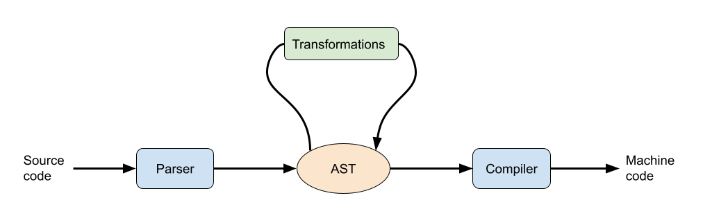

# Macros & Interpreters

## Syntactic macros

The following section should only briefly introduce syntactic macros. At the
same time, I will explain a related topic on how Racket processes source files.
What happens if we press the `Run` button in DrRacket or execute `racket
source.rkt` in a shell?

1. Racket must first parse our source file consisting of a sequence of
   characters. In other words, the sequence of characters is converted into a data
   structure. This data structure is called [Abstract Syntax
   Tree](https://en.wikipedia.org/wiki/Abstract_syntax_tree) (AST) and contains all
   the information extracted from the source file, i.e., our expressions,
   definitions, etc. Due to the homoiconicity of Racket, Racket's syntax directly
   corresponds to regular lists. Thus AST is represented through lists. For
   example, if our source file contains `(+ (* 2 3) 4)`, AST is a list whose first
   element is `+`, followed by a list `(* 2 3)`, and `4`. Moreover, each part of
   AST is enriched by further syntactic information, e.g., the corresponding line
   and column in the source file.

2. Once AST is created, Racket executes various transformations on AST. In fact,
   some Racket syntactic constructions are implemented as transformations on AST.
   For example, the expression `(and exp1 exp2 exp3)` is transformed into

```scheme
(if exp1
    (if exp2
        exp3
        #f)
    #f)
```

3. When AST consists only of basic syntactic constructions, a compiler
   translates AST into a machine code that can be executed.

The workflow is depicted below:

{ style="width: 100%; margin: auto;" class="inverting-image"}

If we create a Racket program, its expressions get evaluated in the runtime,
i.e., after the compilation phase. On the other hand, syntactic
[macros](https://docs.racket-lang.org/guide/macros.html) allow us to add some
extra transformations into the second phase before the compilation.  Macros are
basically functions operating on AST. Thanks to the homoiconicity, AST is
represented as usual data in Racket. Thus macros can be defined as usual Racket
functions.

Implementing macros is a complex topic. The simplest way to introduce a macro is
based on pattern matching. We specify a syntax rule consisting of a pattern and
a template on how the pattern should be rewritten. Racket tries to match the
pattern against pieces of our code. Once there is a match, the corresponding
portion of the code is rewritten according to the template.

Recall the function [`my-if`](/lectures/lecture04#lazy-evaluation), whose
parameters must be passed as thunks.  We cannot eliminate those thunks because
the parameters get evaluated before the function body. However, injecting them
before the compilation by a macro is possible.

```scheme
(define-syntax-rule (macro-if c a b)
  (my-if c (thunk a) (thunk b)))

(define (my-if c a b)
  (if c (a) (b)))
```
The macro defines a syntax rule whose pattern is `(macro-if c a b)`. Racket
searches for a portion of AST being a list of length $4$ starting with a symbol
`macro-if`. If such a list is found, it is rewritten into `(my-if c (thunk a)
(thunk b))`.
Thus we can use in our code `macro-if` instead of `my-if`. Racket automatically translates all
occurrences of `macro-if` to `my-if` with the thunks injected.

A macro can be composed of several syntax rules. We can specify several patterns
to be matched against the AST and templates for each pattern. If any pattern
matches, the corresponding template defines how to rewrite the code. For
example, let us implement a macro introducing comprehension terms into Racket. A
comprehension term allows us to define a new list from a list by means of an
expression and predicate. They are common in Python. For instance,
```python
python> [x**2 for x in range(5)]
[0, 1, 4, 9, 16]

python> [x for x in range(20) if x % 2 == 0]
[0, 2, 4, 6, 8, 10, 12, 14, 16, 18]
```
We want to define a similar syntax for Racket via a macro. We will express the above Python examples in Racket as follows:
```scheme
> (list-comp (* x x) : x <- (range 5))
'(0 1 4 9 16)

> (list-comp x : x <- (range 20) if (even? x))
'(0 2 4 6 8 10 12 14 16 18)
```

We must define a macro with two syntax rules to make the new syntax work—one for the comprehension term without and one for the comprehension term with an if clause.
```scheme:line-numbers
(define-syntax list-comp
  (syntax-rules (: <- if)
    [(list-comp <expr> : <id> <- <lst>)
     (map (lambda (<id>) <expr>) <lst>)]

    [(list-comp <expr> : <id> <- <lst> if <cond>)
     (map (lambda (<id>) <expr>)
          (filter (lambda (<id>) <cond>) <lst>))]))
```
Line 3 defines a pattern for the comprehension term without an if clause. Line 4 specifies how to
rewrite the comprehension term. The symbol `<id>` together with the expression `<exp>` define a
function to be applied to each element of the list `<lst>`. Line 6 represents the second pattern
containing the if clause. In that case, we must first filter the list `<lst>` based on the if clause
(Line 8) and then apply the function to each element of the filtered list (Line 7).

::: tip More on Macros
If you want to read more about Macros, good starting points are the *Beautiful Racket* explainers
on [macros](https://beautifulracket.com/explainer/macros.html),
[hygiene](https://beautifulracket.com/explainer/hygiene.html), [syntax
patterns](https://beautifulracket.com/explainer/syntax-patterns.html), and of course the [Racket
docs](https://docs.racket-lang.org/guide/macros.html).
:::

## Interpreters

Interpreters are programs that *directly*[^compilers] execute instructions of a
programming language (in our case that means evaluating S-expressions).
Before we can create an interpreter for a given programming language we need to define the language
itself. Generally, programming languages are composed of two parts:
- **Syntax**: Tells you what kind of expressions you can write to obtain a valid program.
  The *grammar* defines how larger expression are built from primitives.
- **Semantics**: Assigns *meaning* of certain primitives. For example, it
  can define what the operation `+` does.

[^compilers]: Interpreters *directly* execute programs, while [compilers](https://en.wikipedia.org/wiki/Compiler)
    translate one language into another (typically a from a higher-level to a lower level language).

Based on a well defined language interpreters usually work in two major phases.
After you provide the source code, the interpreter first **parses**[^lexing] the
text into an abstract syntax tree (AST).  Then the AST is **evaluated** to
produce the final output.

[^lexing]: Parsing can include an initial lexing phase which generates tokens
    from your code without creating a tree structure, and only then outputting an
    AST.

In the case of LISP-like languages we already wrote our code in terms of
S-expressions, which means that *we don't have to worry about parsing our code*
at all! Parsing is provided for free by the racket language, because it is *homoiconic*[^homoiconic].
Meaning, our source code is already written as a nested list.
Hence, we will only have to worry about the evaluation of given S-expressions.[^monadic-parsing]

[^homoiconic]: [Homoiconicity](https://en.wikipedia.org/wiki/Homoiconicity)
  essentially means `code == data`, so that programs that are written in
  homoiconic languages can immediately be used as data-structures (in our case:
  lists).

[^monadic-parsing]: If you have been looking forward to a lecture on parsing and
  are now disappointed, do not despair, we will have a full lecture on [*monadic
  parsing*](https://www.cs.nott.ac.uk/~pszgmh/monparsing.pdf) in a few weeks
  during the Haskell part of this course.


### Brainf*ck

Interpreting a full-fledged programming language is quite tricky, so we will choose a very simple
language to interpret, called [Brainf*ck](https://en.wikipedia.org/wiki/Brainfuck).
Here is an example of a valid Brainf*ck program (we will see what it does in a little while):
```
,>,[-<+>]<.
```
Most of the characters above represent operations on a *tape* of numbers (which typically is filled
with zeros at the start of the program) and a *pointer* to the current position on the tape:
```
  ↓
0 0 0 0 0 0 0 ...
  ↑
```
The different operations can e.g. increment the number at the current pointer position, or move the
pointer. The full list of operations can be found in the table below.
In addition to the tape, the user can also provide data to a program via a list of inputs.

| Character  | Meaning                                                                      |
| ---------- | ---------------------------------------------------------------------------- |
| >          | Increment the data pointer by one (to point to the next cell to the right).  |
| <          | Decrement the data pointer by one (to point to the next cell to the left).   |
| +          | Increment the byte at the data pointer by one.                               |
| -          | Decrement the byte at the data pointer by one.                               |
| .          | Output the byte at the data pointer.                                         |
| ,          | Accept one byte of input, storing its value in the byte at the data pointer. |
| [ `code` ] | While the number at the data pointer is not zero, execute `code`.            |

With the table above we can decipher the first example program `,>,[-<+>]<.`:
Let's assume we have two numbers waiting in our input list and a fresh tape:
```
input: '(2 3)
tape:
↓
0 0 0 0 0 0 0 ...
↑
```

1. `,`: Read a number from the input and store it at the pointer position. Now
   input and tape look like this:
```
input: '(3)
tape:
↓
2 0 0 0 0 0 0 ...
↑
```

2. `>`: Move pointer to right.
3. `,`: Read a second number from the input. Now the input is empty and the tape
   contains the two number we read:
```
input: '()
tape:
  ↓
2 3 0 0 0 0 0 ...
  ↑
```
4. `[-<+>]`: Is a cycle, which we will keep executing until the number at the current pointer is zero.
   Currently, it is `3`, so we run the cycle. The cycle itself contains four operations which decrement
   the number at the current position, move the pointer to the left, increment the number there, and
   finally moves the pointer back to the right.
```
input: '()
tape:
  ↓
3 2 0 0 0 0 0 ...
  ↑
```
5. The cycle is repeated another two times until the current pointer is zero:
```
input: '()
tape:
  ↓
5 0 0 0 0 0 0 ...
  ↑
```
6. `<.`: Finally, we move the pointer to the left again, and output the current value.

**We just added two numbers!**

---

More formally, Brainf*ck is a minimalistic, esoteric programming language that
defines computations over a fixed-size tape of numbers. The syntax grammar of
the language is given by
```
<program> -> <term>*
<term>    -> <cmd> | <cycle>
<cycle>   -> [<program>]
<cmd>     -> + | - | < | > | . | ,
```

which means that a `<program>` is a sequence of `<term>`s. Each term is either a
command (`<cmd>`) or a `<cycle>`. We already listed the six possible commands
above. Inside cycles we can nest whole programs which gives us the ability to
write arbitrary loops. Thus, we can write a *syntactically* well-formed expression simply with
arbitrary sequence of commands. The only thing we have to take care of is to
match parentheses appropriately.

For our interpreter, we will represent Brainf\*ck programs simply as lists of terms. Cycles will form
nested lists.  To make things more convenient for us we will slightly alter the
syntax of Brainf\*ck, because `.` and `,` are already taken in Racket (for pairs
and quoting). We will substitute them by `@` and `*`, respectively:

| Character  | Substitue | Meaning                                                                      |
| ---------- | --------- | ---------------------------------------------------------------------------- |
| >          | >         | Increment the data pointer by one (to point to the next cell to the right).  |
| <          | <         | Decrement the data pointer by one (to point to the next cell to the left).   |
| +          | +         | Increment the byte at the data pointer by one.                               |
| -          | -         | Decrement the byte at the data pointer by one.                               |
| .          | @         | Output the byte at the data pointer.                                         |
| ,          | *         | Accept one byte of input, storing its value in the byte at the data pointer. |
| [ `code` ] | [`code`]  | While the number at the data pointer is not zero, execute `code`.            |

With the substitutions we can define our addition program as
```scheme
(define add-prg '(@ > @ [- < + >] < *))
```

Our final implementation will define a function `run-prg` which accepts a
program and some input, for example:
```scheme
> (run-prg add-prg '(12 34))
46
```

### Mutable Tape

During the lecture we will use a *global*, *mutable* tape (bad!) to implement our
interpreter (you will modify this implementation to use an immutable tape during
the labs).

::: details Vectors: [`make-vector`](https://docs.racket-lang.org/reference/vectors.html#%28def._%28%28quote._~23~25kernel%29._make-vector%29%29), [`vector-ref`](https://docs.racket-lang.org/reference/vectors.html#%28def._%28%28quote._~23~25kernel%29._vector-ref%29%29), and [`vector-set!`](https://docs.racket-lang.org/reference/vectors.html#%28def._%28%28quote._~23~25kernel%29._vector-set%21%29%29).

We are not discussing mutable data-structures in this course, but Racket does support them.
Here we only briefly show you [Vectors](https://docs.racket-lang.org/reference/vectors.html)
so that you can get rid of them again during the labs.
Racket's vectors are fixed-length arrays with
constant-time access and update of their elements numbered from 0.

For the purposes of this initial interpreter implementation we only need the following functions:
```scheme
> (define v (vector 1 2 3))
> v
'#(1 2 3)

> (vector-ref v 2)
3

> (vector-set! v 2 "hi")
> v
'#(1 2 "hi")

> (make-vector 4 'a)
'#(a a a a)
```
:::

Our tape will be represented by a mutable vector of numbers which we can initialize with
```scheme
> (define SIZE 10)
> (define t (make-tape SIZE 0))
'#(0 0 0 0 0 0 0 0 0 0)
```
And mutate via the [`vector-set!`](https://docs.racket-lang.org/reference/vectors.html#%28def._%28%28quote._~23~25kernel%29._vector-set%21%29%29) function.
```
> (vector-set! t 2 5)
> t
'#(0 0 5 0 0 0 0 0 0 0)
```

We will implement the tape and the possible operations on the tape by defining a
[closure](lecture03#closures).  The closure will hold the tape itself, a pointer `ptr` to the
current position, and will accept a number of messages `msg` that trigger operations on the tape:

```scheme
(define (make-tape size)
  (define tape (make-vector size 0))
  (define ptr 0)

  (lambda (msg)
    (cond
      [(eqv? msg 'tape) (list tape ptr)]
      [(eqv? msg 'plus) (vector-set! tape ptr (+ 1 (vector-ref tape ptr)))])))
```

The tape can then be used like this:
```scheme
> (define tp (make-tape SIZE))
> (tp 'tape) ; output tape and pointer
'(#(0 0 0 0 0 0 0 0 0 0) 0)

> (tp 'plus)

> (tp 'tape)
'(#(1 0 0 0 0 0 0 0 0 0) 0)
```

### Command Implementation

Implementing the operations for the commands `<`, `>`, `+`, `-`, `@`, and `.` is now
straightforward:

```scheme
(define (make-tape size)
  (define tape (make-vector size 0))   ; initialize fresh tape
  (define ptr 0)                       ; pointer points to the first element

  (define (change op ptr)
    (vector-set! tape ptr (op (vector-ref tape ptr) 1)))

  (define (move op ptr)
    (let ([new-ptr (op ptr 1)])
      (if (or (< new-ptr 0) (> new-ptr size))
          (error "Moving outside tape")
          new-ptr)))

  (lambda (msg)
    (match msg
      ['tape (list tape ptr)]
      ['plus (change + ptr)]
      ['minus (change - ptr)]
      ['left (set! ptr (move - ptr))]
      ['right (set! ptr (move + ptr))]
      ['dot (vector-ref tape ptr)]
      ['comma (lambda (val) (vector-set! tape ptr val))]
      ['reset (vector-fill! tape 0) (set! ptr 0)])))
```


Wit the code above we can already manually run instructions on our tape that resemble Brainf*ck
programs:
```scheme
> (define t (make-tape SIZE))
> (t 'tape)
'(#(0 0 0 0 0 0 0 0 0 0) 0)

> ((t 'comma) 2)  ; read the number 2 from an input
> (t 'tape)
'(#(2 0 0 0 0 0 0 0 0 0) 0)

> (t 'right)
> ((t 'comma) 3) ; read the number 3 from an input
> (t 'tape)
'(#(2 3 0 0 0 0 0 0 0 0) 1)
```


### Program evaluation

In order to evaluate whole Brainf*ck programs we now just have to implement a function that accepts
a program (as a nested list of operations) and a list of inputs. The user-facing function of our
interpreter, `run-prg` will look very simple:
```scheme
(define (run-prg prg input)
  (tape 'reset)              ; fill tape by zeros
  (eval-prg prg input)       ; evaluate program
  (displayln "done"))
```

With pattern matching the `eval-prg` function can conveniently be split into four cases:
1. If we end up with an empty `prg` we are at the end of our program and simply output the current `input`.
2. When encountering an `'@`-symbol we want to read from the `input`. This is the only time we directly work with the input list, so this case deserves its own function.
3. If the current element in the `prg` list is again a list, we execute a separate cycle function.
4. Otherwise we call our tape operations according to the current symbol.

```scheme
(define (eval-prg prg input)
  (log prg input)
  (match prg
    [(list) input]  ; are all commands processed? if yes, return remaining input
    [(list '@ rest ...) (eval-comma rest input)]
    [(list (? list? cycle) rest ...) (eval-cycle cycle rest input)]
    [(list cmd rest ...) (eval-cmd cmd rest input)]))
```


The last case where we just need to translate symbols to tape operations is the simplest to implement:
```scheme
(define (eval-cmd cmd prg input)
  (match cmd
    ['+ (tape 'plus)]
    ['- (tape 'minus)]
    ['< (tape 'left)]
    ['> (tape 'right)]
    ['* (printf "~a " (tape 'dot))]
    [_ (error "Unknown command")])
  (eval-prg prg input))   ; recursive call processing further commands
```
Note that we are mutating the global tape in the `match` clause and then do a mutually recursive call
to `eval-prg` to continue processing the rest of the program.

If we want to read from an input, we strip on element off the `input`, store it on the tape, and
again continue the evaluation of the rest of `prg`.
```scheme
(define (eval-comma prg input)
  (cond
    [(null? input) (error "Empty input")]
    [else ((tape 'comma) (car input))
          (eval-prg prg (cdr input))]))  ; recursive call processing further commands
```

To run a cycle, we check that the current value is not zero, evaluate the cycle,
and then call `eval-cycle` again (with potentially changed input list).  If the
current value is zero at the beginning of the cycle, we skip its evaluation.
```scheme
(define (eval-cycle cycle prg input)
  (if (= (tape 'dot) 0)                         ; is cycle is finished?
      (eval-prg prg input)                      ; if yes, recursive call preocessing further commands
      (let ([new-input (eval-prg cycle input)]) ; otherwise evaluate cycle code
        (eval-cycle cycle prg new-input))))     ; and execute the cycle again
```

We are done! The complete implementation of our interpreter can be found
[here](/code/lecture05-brainfuck.rkt). Running our
interpreter on the `add-prg` will produce the following output:
```scheme
> (run-prg add-prg '(2 3))
tape: (#(0 0 0 0 0 0 0 0 0 0) 0)  input: (2 3)  cmd: @
tape: (#(2 0 0 0 0 0 0 0 0 0) 0)  input:   (3)  cmd: >
tape: (#(2 0 0 0 0 0 0 0 0 0) 1)  input:   (3)  cmd: @
tape: (#(2 3 0 0 0 0 0 0 0 0) 1)  input:    ()  cmd: (- < + >)
tape: (#(2 3 0 0 0 0 0 0 0 0) 1)  input:    ()  cmd: -
tape: (#(2 2 0 0 0 0 0 0 0 0) 1)  input:    ()  cmd: <
tape: (#(2 2 0 0 0 0 0 0 0 0) 0)  input:    ()  cmd: +
tape: (#(3 2 0 0 0 0 0 0 0 0) 0)  input:    ()  cmd: >
tape: (#(3 2 0 0 0 0 0 0 0 0) 1)  input:    ()  cmd:
tape: (#(3 2 0 0 0 0 0 0 0 0) 1)  input:    ()  cmd: -
tape: (#(3 1 0 0 0 0 0 0 0 0) 1)  input:    ()  cmd: <
tape: (#(3 1 0 0 0 0 0 0 0 0) 0)  input:    ()  cmd: +
tape: (#(4 1 0 0 0 0 0 0 0 0) 0)  input:    ()  cmd: >
tape: (#(4 1 0 0 0 0 0 0 0 0) 1)  input:    ()  cmd:
tape: (#(4 1 0 0 0 0 0 0 0 0) 1)  input:    ()  cmd: -
tape: (#(4 0 0 0 0 0 0 0 0 0) 1)  input:    ()  cmd: <
tape: (#(4 0 0 0 0 0 0 0 0 0) 0)  input:    ()  cmd: +
tape: (#(5 0 0 0 0 0 0 0 0 0) 0)  input:    ()  cmd: >
tape: (#(5 0 0 0 0 0 0 0 0 0) 1)  input:    ()  cmd:
tape: (#(5 0 0 0 0 0 0 0 0 0) 1)  input:    ()  cmd: <
tape: (#(5 0 0 0 0 0 0 0 0 0) 0)  input:    ()  cmd: *
5
```

For larger programs you can take a look at some more
[examples](https://en.wikipedia.org/wiki/Brainfuck#Examples) or, of course, write your own Brainf*ck
programs!
