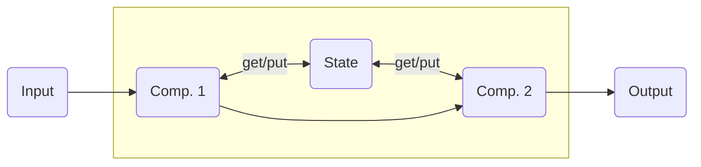
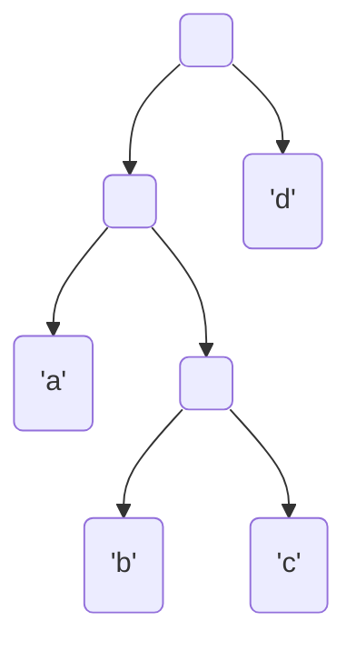
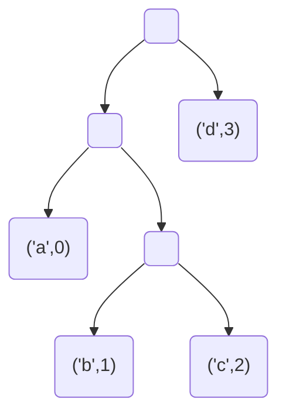
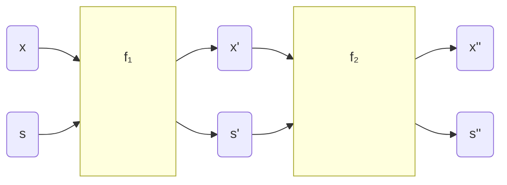
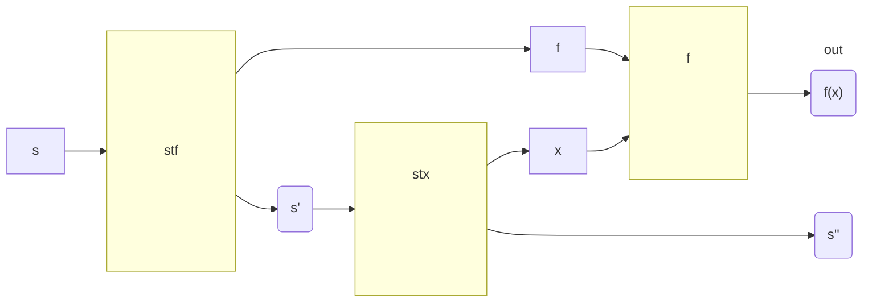

# Stateful Computations

Generally, *almost all interesting computations* are somehow stateful (e.g. even just pushing to a
list already involves a state).  Essentially, every operation that involves some sort of memory
storage is in the end a stateful computation.




In procedural languages, mutating state is so simple and natural that we often do not even think
explicitly about the fact that we are performing a stateful computation.  Unfortunately, in
functional programming we so far had to *explicitly pass around* states (i.e. variables which we
wanted to update), because we want to avoid mutation of (global) variable. While this potentially
makes our code more safe and easier to reason about, it comes at the cost of somewhat clunky
implementations and repetitive boiler plate.

One example which you already know from the labs is labelling a tree. In [Lab 9 - Ex.
3](/labs/lab09#exercise-3) you were asked to transform a tree that contains just `Char`s
into a tree that has leaves labelled with consecutive numbers:

<div style="display: inline-block; width: 50%;">


</div>
<div style="display: inline-block; width: 50%;">


</div>

This can be achieved by explicitly passing around trees and a state (in this case the incrementing
`Int` that will be put in the leaves). The solution looked like below:
```haskell{3-5}
labelHlp :: Tree a -> Int -> (Tree (a, Int), Int)
labelHlp (Leaf x) n = (Leaf (x, n), n+1)
labelHlp (Node left right) n = let (left', n') = labelHlp left n
                                   (right', n'') = labelHlp right n'
                                in (Node left' right', n'')

labelTree :: Tree a -> Tree (a, Int)
labelTree t = fst (labelHlp t 0)
```
Where the implementation for `Node` is really just plumbing to keep track of the updated state (in
the highlighted part of the code).  No actual computation is happening there.

::: tip Note
This lecture focuses on how to abstract away the repetitive parts of our stateful computations and
regain (at least most of) the convenience of procedural programming.

In general, given a function `f` that performs some computation on
`x` but depends also on some state `s` we always need to explicitly keep track of the state, so we
always have two inputs and two outputs to our stateful functions:



The Haskell state monad implements this essentially as a curried function `b -> s -> (a,s)` with two
outputs. After implementing all the necessary typeclasses we will end up with a much tidier version
of the labelling function that looks a lot like procedural code and abstracts away the state
completely (see highlight & don't worry about how it works yet - we will build the solution step by
step later).
```haskell{8-11}
fresh :: State Int Int
fresh = state (\n -> (n, n+1))

label :: Tree a -> State Int (Tree (a, Int))
label (Leaf x) = do
  i <- fresh
  return $ Leaf (x, i)
label (Node l r) = do
  l' <- label l
  r' <- label r
  return $ Node l' r'

labelTree :: Tree a -> Tree (a, Int)
labelTree t = evalState (label t) 0
```
:::


## State Monad

::: tip Note
Haskell provides a powerful way of handling stateful computations in the type `StateT` (`T` for
*transformer*). Unfortunately state transformers are out of the scope of this course, but you can
find more information about them [ADD LINK HERE](). We will work with a slightly simpler
implementation which is easier to understand.
:::

As already mentioned, we will implement stateful computations (naturally) based on curried functions
of two arguments with an input `b`, and the state `s`. These functions will output a tuple of an
output `a` and a (potentially updated) state `s`:
```haskell
st :: b -> s -> (a,s)
```
One very convenient way to encode this in a new type is by defining a `State s a`:
```haskell
newtype State s a = S { runState :: s -> (a,s) }
```
which then means we will work with functions that accept an input `b` and produce a stateful
computation `State s a`:
```haskell
st :: b -> State s a
```

The type `State s a` is chosen like above, because we will want to compose stateful computations.
We can implement `Functor`, `Applicative`, & `Monad` (which will let us do exactly this composition)
for `State s`, meaning the type of the state `s` itself will remain the same throughout our whole
program, while the inputs and outputs can have varying types.

### `Functor (State s)`

With the functor instance we will be able to transform the output `a` of a `State s a` without
modifying the state itself:


<<< ./State.hs{10-12,haskell}



