# Stateful Computations

Generally, *almost all interesting computations* are somehow stateful (e.g. even just pushing to a
list already involves a state).  Essentially, every operation that involves some sort of memory
storage is in the end a stateful computation.


In procedural languages, mutating state is so simple and natural that we often do not even think
explicitly about the fact that we are performing a stateful computation.  Unfortunately, in
functional programming we so far had to *explicitly pass around* states (i.e. variables which we
wanted to update), because we want to avoid mutation of (global) variable. While this potentially
makes our code more safe and easier to reason about, it comes at the cost of somewhat clunky
implementations and repetitive boiler plate.

One example which you already know from the labs is labelling a tree. In [Lab 9 - Ex.
3](/labs/lab09#exercise-3) you were asked to transform a tree that contains just `Char`s
into a tree that has leaves labelled with consecutive numbers:

<div style="display: inline-block; width: 50%;">


</div>
<div style="display: inline-block; width: 50%;">


</div>

This can be achieved by explicitly passing around trees and a state (in this case the incrementing
`Int` that will be put in the leaves). The solution looked like below:
```haskell{3-5}
labelHlp :: Tree a -> Int -> (Tree (a, Int), Int)
labelHlp (Leaf x) n = (Leaf (x, n), n+1)
labelHlp (Node left right) n = let (left', n') = labelHlp left n
                                   (right', n'') = labelHlp right n'
                                in (Node left' right', n'')

labelTree :: Tree a -> Tree (a, Int)
labelTree t = fst (labelHlp t 0)
```
Where the implementation for `Node` is really just plumbing to keep track of the updated state (in
the highlighted part of the code).  No actual computation is happening there.

::: tip Note
This lecture focuses on how to abstract away the repetitive parts of our stateful computations and
regain (at least most of) the convenience of procedural programming.

In general, given a function `f` that performs some computation on
`x` but depends also on some state `s` we always need to explicitly keep track of the state, so we
always have two inputs and two outputs to our stateful functions:

```mermaid
flowchart LR
  x(x) --> f1
  s(s) --> f1
  subgraph f1[" "]
  direction LR
    a("f₁")
    b(" ")
  end
  f1 --> x1("x'")
  f1 --> s1("s'")

  subgraph f2[" "]
  direction LR
    i["f₂"]
    j[" "]
  end
  x1 --> f2
  s1 --> f2

  f2 --> x2("x''")
  f2 --> s2("s''")

  classDef transparent fill:#0000, stroke:#0000
  class i,j,a,b transparent;
```



The Haskell state monad implements this essentially as a curried function `b -> s -> (a,s)` with two
outputs. After implementing all the necessary typeclasses we will end up with a much tidier version
of the labelling function that looks a lot like procedural code and abstracts away the state
completely (see highlight & don't worry about how it works yet - we will build the solution step by
step later).
```haskell{8-11}
fresh :: State Int Int
fresh = state (\n -> (n, n+1))

label :: Tree a -> State Int (Tree (a, Int))
label (Leaf x) = do
  i <- fresh
  return $ Leaf (x, i)
label (Node l r) = do
  l' <- label l
  r' <- label r
  return $ Node l' r'

labelTree :: Tree a -> Tree (a, Int)
labelTree t = evalState (label t) 0
```
:::


## State Monad

::: tip Note
Haskell provides a powerful way of handling stateful computations in the type `StateT` (`T` for
*transformer*). Unfortunately state transformers are out of the scope of this course, but you can
find more information about them [ADD LINK HERE](). We will work with a slightly simpler
implementation which is easier to understand.
:::

As already mentioned, we will implement stateful computations (naturally) based on curried functions
of two arguments with an input `b`, and the state `s`. These functions will output a tuple of an
output `a` and a (potentially updated) state `s`:
```haskell
st :: b -> s -> (a,s)
```
One very convenient way to encode this in a new type is by defining a `State s a`:
```haskell
newtype State s a = S { runState :: s -> (a,s) }
```
which then means we will work with functions that accept an input `b` and produce a stateful
computation `State s a`:
```haskell
st :: b -> State s a
```

The type `State s a` is chosen like above, because we will *of course* want to compose stateful computations.
We can implement `Functor`, `Applicative`, & `Monad` (which will let us do exactly this composition)
for `State s`, meaning the type of the state `s` itself will remain the same throughout our whole
program, while the inputs and outputs can have varying types.

### `Functor (State s)`

With the functor instance we will be able to transform the output `a` of a `State s a` without
modifying the state itself:

```haskell
instance Functor (State s) where
  fmap :: (a -> b) -> State s a -> State s b
  fmap f st = S (\s -> let (x,s') = runState st s
                       in (f x,s'))
```

Graphically we can represent `Functor` implementation like below. The state `s` enters the stateful
computation `st`. When we `runState st` we get a new state `s'` and the input to the function `f` we
need to apply it:


### `Applicative (State s)`

With `Applicative` we can compose two (or more) stateful computations with a given function `f` that
is itself enclosed in a `State` context.  We will not directly need the `<*>` operator itself, but
Haskell's type hierarchy requires it, so we have to implement it.

```haskell
instance Applicative (State s) where
  pure :: a -> State s a
  pure x = S (\s -> (x,s))

  (<*>) :: State s (a -> b) -> State s a -> State s b
  stf <*> stx = S (\s -> let (f,s') = runState stf s
                             (x,s'') = runState stx s'
                         in (f x, s''))
```

First the `<*>` operator runs the `stf`, which encloses a fucntion `f :: a -> b`, then, with the
updated state `s'`, it runs the second stateful computation `stx` to obtain the final state `s''`
and the output `f x`:

```mermaid
flowchart LR

  subgraph stf[" "]
  direction LR
    h1[" "]
    h2["stf"]
    h3[" "]
  end

  subgraph stx[" "]
  direction LR
    h4["stx"]
    h5[" "]
  end

  subgraph fbox[" "]
  direction LR
    h7["f"]
    h6["f :: a →  b"]
  end

  subgraph out[" "]
  direction LR
    fx
    s2
  end

  s --> stf
  stf --> s1("s'")
  stf --> f
  f --> fbox
  s1 --> stx
  stx --> x
  x --> fbox
  fbox --> fx("f(x)")
  stx --> s2("s''")

  classDef transparent fill:#0000, stroke:#0000
  class out,h1,h2,h3,h4,h5,h6,h7 transparent;
  class x,x1,s,s1,s2,fx,f transparent
```



### `Monad (State s)`

Finally, we have the `Monad` instance which will allow us to perform stateful computations in
sequence, while automatically piping the state through or functions.

```haskell
instance Monad (State s) where
  (>>=) :: State s a -> (a -> State s b) -> State s b
  stx >>= f = S (\s -> let (x,s') = runState stx s
                         in runState (f x) s')
```
In the bind operator `>>=` we use the output of the stateful computation `stx` as the input to
construct another stateful computation (note the difference of `f` to the applicative case):

```mermaid
flowchart LR
  subgraph stx[" "]
  direction LR
    h1["stx"]
    h2[" "]
  end

  subgraph fbox[" "]
  direction LR
    h3["f"]
    h4["f :: a →  State s b"]
  end

  s(s) --> stx
  stx --> x(x)
  stx --> s1("s'")
  x --> fbox
  s1 --> fbox
  fbox --> x1("x'")
  fbox --> s2("s''")

  classDef transparent fill:#0000, stroke:#0000
  classDef roundedBlue fill:#add8e6,stroke:#000,stroke-width:2px,rounded:true;
  class out,h1,h2,h3,h4,h5,h6,h7 transparent;
  class x,x1,s,s1,s2,fx transparent
```



If we, replace `State s a` with `s -> (a,s)` in the type signatures for bind it becomes even more
apparent that `>>=` is doing nothing except composing our functions that involve state `s`:
```haskell
(>>=) :: State s a -> (a -> State s b) -> State s b

-- essentially we just curry the output of the first stateful comp.:
(s -> (a,s))  ->  (a -> s -> (b,s))  ->  (s -> (b,s))
```


## Manipulating `State` & do-notation

To work with our new `State` we introduce three useful functions which are also implemented in the
actual, more complicated Haskell implementation `StateT`:
```haskell
state :: (s -> (a,s)) -> State s a
state f = S f

-- extract only the output of our stateful computation
evalState :: State s a -> s -> a
evalState st x = fst $ runState st x

-- extract the state itself
execState :: State s a -> s -> s
execState st x = snd $ runState st x
```

Now, we can prepare ourselves to use `do`-notation with the state monad. Our first example will be
labelling the tree from the beginning of the lecture.
Recalling what we needed to do to label trees: we realized that the only place where we needed to do
a computation with the state was in the case of encountering a `Leaf`. In a `Leaf` we used the
current number $n$ (can be regarded as output `a`) and incremented to $n+1$ (the next state `s`).

We can formalize this as
```haskell
fresh :: State Int Int
fresh = state $ \n -> (n, n+1)

𝝺> runState fresh 0
(0,1)
```

Now, if we define a function `label` that accepts a `Tree a` and outputs a stateful computation we
have to cover the two cases for `Leaf` and `Node` again. We implemented `Monad`, so we have
`do`-notation available. The variable at the left of `<-` will be the argument in which `State` is
monadic, so `a`. That means we can access the output of a stateful computation super easily via: `i
<- fresh`. In practice, this will result in a `label` function:

```haskell
label :: Tree a -> State Int (Tree (a,Int))
label (Leaf x) = do
  i <- fresh  -- extract the current label number
  return $ Leaf (x,i) -- insert into tree

-- to execute the stateful comp., first construct it via `label`
𝝺> stl = label (Leaf 'a')
-- then run it with an initial value
𝝺> runState stl 0
(Leaf ('a',0),1)
```
The state update is done automagically! If this is confusing to you, check out the details below.

::: details Step-by-step: `label (Leaf x)`
The `do`-notation above can be rewritten to `>>=`. The we just have to replace the definitions of
`return`/`runState` to obtain the result:
```haskell
fresh >>= (\i -> return $ Leaf (x,i))

-- definition of >>=
--  stx >>= f = S (\s -> let (x,s') = runState stx s
--                       in runState (f x) s')

-- >>= extracts the function inside fresh state comp.
--     and supplies an initial argument i
runState fresh i
  (\n -> (n,n+1)) i
  (i,i+1)

-- then we use the results and pass them on:
runState ((\i -> return $ Leaf (x,i)) i) (i+1)
  runState (return $ Leaf (x,i)) (i+1)
  (\s -> (Leaf (x,i), s)) (i+1)
  (Leaf (x,i), (i+1))
```
:::

The labelling of `Node`s becomes practically trivial, because the state monad is taking care of all
the plumbing for us. Nice!
```haskell
label :: Tree a -> State Int (Tree (a,Int))
label (Leaf x) = do
  i <- fresh
  return $ Leaf (x,i)
label (Node l r) = do
  l' <- label l
  r' <- label r
  return $ Node l' r'

labelTree :: Tree a -> Tree (a, Int)
labelTree t = evalState (label t) 0

tree :: Tree Char
tree = Node (Leaf 'a') (Node (Leaf 'b') (Leaf 'c'))

𝝺> labelTree tree
Node (Leaf ('a',0)) (Node (Leaf ('b',1)) (Leaf ('c',2)))
```

Additionally, we will want to read/write to current state. For this we can define three useful
functions:
```haskell
-- Effectively moves the state to the output
-- such that we can do x <- get
get :: State s s
get = state (\x -> (x,x))

-- Let's us write `put x` in do-notation to update the state
put :: s -> State s ()
put x = state (\_ -> ((),x))

-- Applies a function to the state.
-- Conveniently implemented via get/put and do-notation:
modify :: (s -> s) -> State s ()
modify f = do x <- get
              put (f x)
              return ()
```

## Random values

A function returning a random value cannot be pure (by definition) so it would have to be enclosed
inside IO monad. But, we want most of our code to be pure!  Pseudorandom generators allow generating
random values based on an initial seed, that is updated an passed on:
```haskell
-- random number in range (0,100)
rand100 :: Int -> (Int, Int)
rand100 seed = (n, newseed) where
  newseed = (1664525 * seed + 1013904223) `mod` (2^32)
  n = (newseed `mod` 100)
```
This looks like a great application of our newly acquired knowledge about `State s a`!

### `System.Random`

The Haskell library `System.Random` is designed to generate pseudorandom values.  It uses values of
`StdGen` as seed values (called generators). We can create generators by calling the function:
```haskell
mkStdGen :: Int -> StdGen
```
Given a generator, a random value of type `a` in a given interval, can be generated by
```haskell
randomR :: (RandomGen g, Random a) => (a, a) -> g -> (a, g)

𝝺> randomR (0,100) (mkStdGen 1)
(46,80028 40692)
```

`Random` is a type class of the types for which we can generate pseudorandom values:
```haskell
class Random a where
  randomR :: RandomGen g => (a, a) -> g -> (a, g)
  default randomR :: (RandomGen g, UniformRange a) =>
                     (a, a) -> g -> (a, g)
  random :: RandomGen g => g -> (a, g)
  default random :: (RandomGen g, Uniform a) => g -> (a, g)
  randomRs :: RandomGen g => (a, a) -> g -> [a]
  randoms :: RandomGen g => g -> [a]
        -- Defined in ‘System.Random’
instance Random Bool -- Defined in ‘System.Random’
instance Random Char -- Defined in ‘System.Random’
instance Random Double -- Defined in ‘System.Random’
instance Random Float -- Defined in ‘System.Random’
instance Random Int -- Defined in ‘System.Random’
instance Random Integer -- Defined in ‘System.Random’
...
```

If we want to compute sequences of random values, we could naively do it like this:
```haskell
rand3Int :: Int -> StdGen -> ([Int], StdGen)
rand3Int m g0 = ([n1,n2,n3],g3)
  where
    (n1,g1) = randomR (0,m) g0
    (n2,g2) = randomR (0,m) g1
    (n3,g3) = randomR (0,m) g2
```

But of course there is a much nicer way by using the state monad. First we define a new type `R a`
which will hold a random number generator `StdGen` and a type `a` (from which we want random
samples). With `>>=` already defined for `State StdGen` we just have to wrap `randomR :: StdGen ->
(a, StdGen)` into a `State` to immediately be able to use it with do-notation:
```haskell
type R a = State StdGen a

randIntS :: Int -> R Int
randIntS m = state $ randomR (0,m)

rand3IntS :: Int -> R [Int]
rand3IntS n = do n1 <- randIntS n
                 n2 <- randIntS n
                 n3 <- randIntS n
                 return [n1,n2,n3]
```
We can of course use the higher order functions over monads to get more than just three random numbers;)
```haskell
manyRandIntS :: Int -> R [Int]
manyRandIntS n = mapM randIntS $ repeat n
```

::: details Why does `mapM` return different random numbers?
Being able to use `mapM` above to generate a sequence of random numbers is great, but why does it
work? Shouldn't `mapM` receive the same arguments every time and produce the same result?
It becomes clear when taking a look at the implementation of `mapM` that this is not the case:
```haskell
mapM :: (Monad m) => (a -> m b) -> [a] -> m [b]
mapM f [] = return []
mapM f (x:xs) = do
    y <- f x
    ys <- mapM f xs
    return (y:ys)
```
As we can see, `mapM` *sequences* `f x` for every stateful computation.
:::


