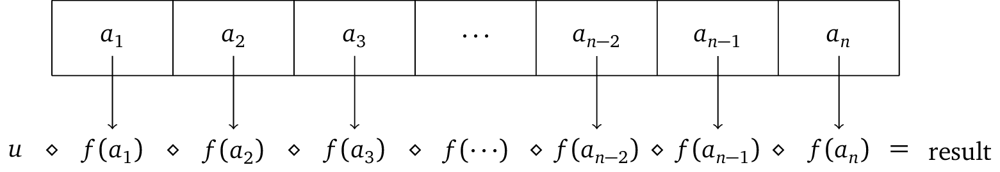

# Monoids & Foldables

The _**fold**_ operation is one of (if not *the*) most important construction in functional
programming. An example we have seen very often already is using `foldr` to sum a list of numbers:

```haskell
𝝺> sum = foldr (+) 0
𝝺> sum [1,2,3]
6
```

But there are many more things we can do with a fold! Another example is to define `and`:
```haskell
𝝺> and = foldr (&&) True
𝝺> and [True,True,True]
True

𝝺> and [True,False]
False
```
An perhaps a tiny bit more interesting, counting the number of a specific element in a list:
```haskell
𝝺> count e = foldr (\x acc -> if e==x then acc+1 else acc) 0
𝝺> count 2 [1,2,1,2,2,3]
3
```
Arguably the most advanced example we have seen of a fold is the monadic fold of mazes in `setPath`
of [Lab 12](/labs/lab12#manipulations-with-maze).

Importantly, we can implement a number of useful functions _**in terms of fold**_, so theoretically,
we don't need much more than a datastructure being foldable. For example:
```haskell
length = foldr (\_ -> (+1)) 0
map f = foldr ((:) . f) []
```

:::  tip Fold: Aggregation & traversal
If we take a look at the type signature of `foldr` we see that it contains a `Foldable` type
constraint:
```haskell
foldr :: Foldable t => (b -> a -> b) -> b -> t a -> b
```
In this lecture we will explore the essence of this `Foldable` typeclass and pick at the different
parts that make a fold. Conceptually, there are two parts to folding:
1. The _**aggregation**_ - represented by the function `b -> a -> b`. We will use an abstraction
    called a [`Monoid`](#aggregation-semigroups-monoids) to treat this part of the fold separately.
2. The _**traversal**_ - which walks over the foldable datastructure `t a`. This is what the [`Foldable`](#traversal-foldables) typeclass is doing.
:::

## Semigroups

Before we get to monoids which represent the aggregation part of a fold, we will define a semigroup.

A _**semigroup**_ is a $\langle S, \diamond\rangle$ is a set $S$ equipped with a
binary operation $\diamond : S \times S \rightarrow S$ that satisfies the associative property

$$ a \diamond (b \diamond c) = (a \diamond b) \diamond c. $$

For example, addition on the natural numbers forms a semigroup: The domain $\mathbb N$ with the operation $+$
satisfies associativity: $a+(b+c) = (a+b)+c$.

In Haskell, the typclass `Semigroup` defines an operation `<> :: a -> a -> a`.
```haskell
class Semigroup a where
  (<>) :: a -> a -> a
```
For lists we can implement semigroup simply with `++`:
```haskell
instance Semigroup [a] where
  (<>) = (++)

> [1,2,3] <> [4,5,6]
[1,2,3,4,5,6]
```

## Monoids

A _**monoid**_ $\langle M, \diamond, u \rangle$ is a semigroup with a *unit* $u \in M$ that satisfies

$$ u \diamond a = a = a \diamond u. $$

In other words, a monoid has an identity element (e.g. for $+$ this element would be $0$).

Some examples of monoids are:

- $\langle \mathbb N, +, 0 \rangle$ - Addition of natural numbers
- $\langle \mathbb N, \times, 1 \rangle$ - Multiplication of natural numbers
- $\langle$ `[a]`, `++` , `[]` $\rangle$ - Lists and concatenation
- $\langle A^A, \circ, \text{id} \rangle$ - Selfmaps $f:A\rightarrow A$ form a monoid under composition $\circ$.

The `Monoid` typeclass adds the identity element `mempty`
```haskell
class Semigroup a => Monoid a where
  mempty :: a
```
which for the list monoid is the empty list.
```haskell
instance Monoid [a] where
  mempty = []
```

For `Int`s we already noticed that we can have multiple monoids. To define a monoid over addition we
therefore need a new type
```haskell
newtype Sum a = Sum {getSum :: a}

instance Num a => Semigroup (Sum a) where
  (Sum a) <> (Sum b) = Sum (a + b)

instance Num a => Monoid (Sum a) where
  mempty = Sum 0

𝝺> (Sum 7) <> (Sum 4)
Sum {getSum = 11}
```

::: tip *WHY?!*
Great question. Why should we jump through the hoops of *defining another type for addition*?!
1. *Abstraction*. Remember, monoids let us separate the aggregation part of a fold. This is useful
   because we only need to define `<>` for a new type and we can immediately fold e.g. over lists,
   trees, and anything that's foldable.
2. Semigroups give us *associativity*, which we can use to our advantage. For example, we can
   evaluate large expressions of `<>` in *any order*. This means, for example, that we can execute
   huge folds in a distributed fashion:

Assume that `<>` is an operation that is much more expensive than a simple `+`, then we can execute
the first `(...)` on a different process/device and accumulate afterwards without having to worry
about correctness.
```haskell
(a <> b <> c) <> (d <> e <> f)
```
:::


### Simple examples of monoids

`Any` (resp. `All`) is the disjunctive (resp. conjunctive) monoid on `Bool`:

```haskell
𝝺> (Any False) <> (Any True) <> (Any False)
Any {getAny = True}
```

For a monoid `m` its dual monoid is `Dual m`
```haskell
𝝺> (Dual "a") <> (Dual "b") <> (Dual "c")
Dual {getDual = "cba"}
```

Product of monoids:
```haskell
𝝺> (Sum 2,Product 3) <> (Sum 5,Product 7)
(Sum {getSum = 7},Product {getProduct = 21})
```


### Advanced examples of monoids
`Map` is a monoid under `union`:
```haskell
𝝺> Map.fromList [(1,"a")] <> Map.fromList [(1,"b")] <> Map.fromList [(2,"c")]
fromList [(1,"a"),(2,"c")]
```
where `<> = Map.union` is a *left-biased* union of keys (meaning, the left-most argument with the
same key will override the ones further to the right).

We could implement another monoid instance for `Map`, which instead of overwriting recurring keys,
accumulates the corresponding values. For this we need a new type we can call `MMap`:
```haskell
newtype MMap k v = MMap (Map.Map k v)

fromList :: Ord k => [(k,v)] -> MMap k v
fromList xs = MMap (Map.fromList xs)

instance (Ord k, Monoid v) => Semigroup (MMap k v) where
  (MMap m1) <> (MMap m2) = MMap (Map.unionWith mappend m1 m2)
```
By defining `<>` via the `unionWith` function and `mappend` (monoidal append) we can
accumulate any `MMap` that has values which are instances of `Monoid`:

```haskell
𝝺> fromList [(1,"a")] <> fromList [(1,"b")] <> fromList [(2,"c")]
MMap (
 1 : "ab"
 2 : "c"
)

𝝺> fromList [('a', Sum 1)] <> fromList [('a',Sum 2)] <> fromList [('b',Sum 3)]
MMap (
 'a' : Sum {getSum = 3}
 'b' : Sum {getSum = 3}
)
```

The `Monoid` typeclass also defines the `mconcat` helper function
```haskell
mconcat = foldr (<>) mempty
```
allowing us to combine any number of monoids simply by wrapping them in a list.
```haskell
𝝺> mconcat [Sum 1, Sum 2, Sum 3, Sum 4]
Sum {getSum = 10}
```

## Traversal: Foldables

With `Monoid` we have successfully abstracted away the aggregation part of folding operations.
Now we have to formalize how to traverse datastructures we want to fold.

Let $M = \langle M, \diamond, u\rangle$ be a monoid, $f : A\rightarrow M$ a function that takes a
values of type $A$ to a monoid, and `lst = [a1, ... , an]` a list of elements from $A$.
The function `foldMap` of `lst` w.r.t. $M$ and $f$ is the composition of `map f` followed by the
aggregation $\diamond$.

{class="inverting-image"}

To make something `Foldable`, we only have to implement `foldMap` [^foldr]:
```haskell
instance Foldable [] where
  foldMap f = mconcat . map f
```
and we will get a lot of functions for free (including `length`, `elem`, `maximum`,
etc.)

```haskell
𝝺> :i Foldable
type Foldable :: (* -> *) -> Constraint
class Foldable t where
  fold :: Monoid m => t m -> m
  foldMap :: Monoid m => (a -> m) -> t a -> m
  foldMap' :: Monoid m => (a -> m) -> t a -> m
  foldr :: (a -> b -> b) -> b -> t a -> b
  foldr' :: (a -> b -> b) -> b -> t a -> b
  foldl :: (b -> a -> b) -> b -> t a -> b
  foldl' :: (b -> a -> b) -> b -> t a -> b
  foldr1 :: (a -> a -> a) -> t a -> a
  foldl1 :: (a -> a -> a) -> t a -> a
  toList :: t a -> [a]
  null :: t a -> Bool
  length :: t a -> Int
  elem :: Eq a => a -> t a -> Bool
  maximum :: Ord a => t a -> a
  minimum :: Ord a => t a -> a
  sum :: Num a => t a -> a
  product :: Num a => t a -> a
  {-# MINIMAL foldMap | foldr #-}
        -- Defined in ‘Data.Foldable’
instance Foldable (Either a) -- Defined in ‘Data.Foldable’
instance Foldable [] -- Defined in ‘Data.Foldable’
instance Foldable Maybe -- Defined in ‘Data.Foldable’
instance Foldable Solo -- Defined in ‘Data.Foldable’
instance Foldable ((,) a) -- Defined in ‘Data.Foldable’
```

[^foldr]:
    For in depth information about `Foldable` implementations you can refer to the [Haskell
    Wiki](https://en.wikibooks.org/wiki/Haskell/Foldable). Most importantly, it shows how to implement
    `foldr` in terms of `foldMap` by exploiting the monoid of self-maps.


For new types like `Tree a` we have to implement `foldMap` to inform Haskell about how to traverse
it. For a tree we can define
```haskell
data Tree a = Leaf a | Node (Tree a) (Tree a)

instance Foldable Tree where
  foldMap :: Monoid m => (a -> m) -> Tree a -> m
  foldMap f (Leaf x) = f x
  foldMap f (Node l r) = foldMap f l <> foldMap f r

tree :: Tree Int
tree = Node (Leaf 7) (Node (Leaf 2) (Leaf 3))

𝝺> foldMap Sum tree
Sum {getSum = 12}
```
which immediately lets us fold any `Tree m` where `Monoid m => Tree m`.

{class="inverting-image"}

### Example: `MMap` statistics

For `MMap`s we already have a monoid instance, so let's use it to compute some statistics.
With a simple `Count` monoid we can compute how many elements of a given value are in a list:
```haskell
instance Semigroup Count where
  (Count n1) <> (Count n2) = Count (n1+n2)

instance Monoid Count where
  mempty = Count 0

count :: a -> Count
count _ = Count 1

singleton :: k -> v -> MMap k v
singleton k v = MMap (Map.singleton k v)

𝝺> foldMap (\x -> singleton x (count x)) [1,2,3,3,2,4,5,5,5]
MMap (
 1 : Count 1
 2 : Count 2
 3 : Count 2
 4 : Count 1
 5 : Count 3
)
```

Perhaps more interestingly, we can use a product of monoids (i.e. a tuple of monoids) to compute
statistics over the first letter of a list of words:
```haskell
ws = words $ map toLower "Size matters not. Look at me. Judge me by my size, do you? Hmm? Hmm. And well you should not. For my ally is the Force, and a powerful ally it is. Life creates it, makes it grow. Its energy surrounds us and binds us. Luminous beings are we, not this crude matter. You must feel the Force around you; here, between you, me, the tree, the rock, everywhere, yes. Even between the land and the ship."
it :: [String]
```

We can define a function that collects a bunch of monoids which we want to fold over:
```haskell
stats :: Foldable t => t a -> (Count, Min Int, Max Int)
stats word = (count word, Min $ length word, Max $ length word)

𝝺> stats "size"
(Count 1,Min 4,Max 4)
```

Each of the monoids above we want to again fold over `MMap`s with the first character as keys.
Effectively `MMap` is very similar to grouping, hence the name `groupBy`:
```haskell
groupBy :: (Ord k, Monoid m) => (a -> k) -> (a -> m) -> (a -> MMap k m)
groupBy keyf valuef a = singleton (keyf a) (valuef a)

𝝺> groupBy head stats "size"
MMap (
 's' : (Count 1,Min 4,Max 4)
)
```

Finally we just have to call `foldMap` to accumulate all the `stats`.
```haskell
𝝺> foldMap (groupBy head stats) ws
MMap (
 'a' : (Count 10, Min 1, Max  6)
 'b' : (Count  5, Min 2, Max  7)
 'c' : (Count  2, Min 5, Max  7)
 'd' : (Count  1, Min 2, Max  2)
 ...
 'w' : (Count  2, Min 3, Max  4)
 'y' : (Count  6, Min 3, Max  4)
)
```

